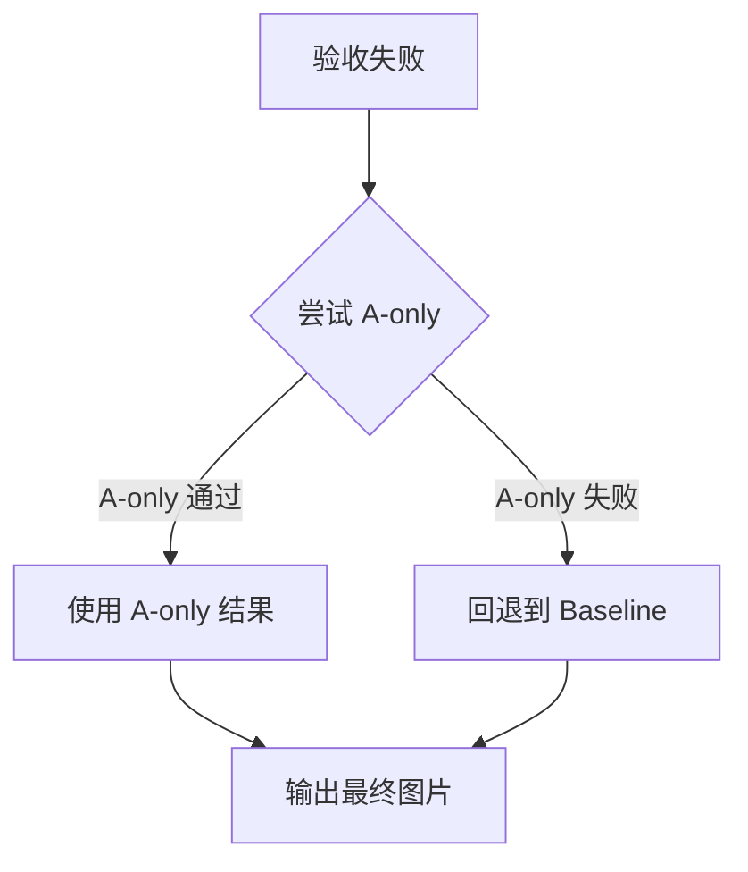

# Robust 预设完整参数配置与工作流程

**文档日期**: 2025-10-27  
**脚本版本**: extract_pdf_assets.py v2.5 (Layout-Driven Enhanced)  
**命令**: `python3 scripts/extract_pdf_assets.py --pdf <path> --preset robust --debug-visual --layout-driven`

---

## 📋 命令行参数组合

```bash
python3 scripts/extract_pdf_assets.py \
  --pdf <PDF_PATH> \
  --preset robust \          # 稳健预设
  --debug-visual \           # 可视化调试
  --layout-driven            # 版式驱动
```

---

## 🎯 Robust 预设自动启用的参数

### 1. 基础渲染参数

| 参数 | 值 | 说明 |
|------|-----|------|
| `--dpi` | **300** | PNG 输出分辨率 |
| `--clip-height` | **520.0 pt** | 基线裁剪窗口高度 |
| `--margin-x` | **26.0 pt** | 左右边距 |
| `--caption-gap` | **6.0 pt** | 图注与图片间距 |

### 2. 锚点扫描（Anchor V2）

| 参数 | 值 | 说明 |
|------|-----|------|
| `--anchor-mode` | **v2** | 多尺度滑窗锚点策略 |
| `--scan-step` | **14.0 pt** | 垂直扫描步长 |
| `--scan-heights` | **240,320,420,520,640,720,820,920** | 7 个窗口高度 |
| `--scan-dist-lambda` | **0.12** | 距离罚项权重（越大越倾向紧邻） |
| `--caption-mid-guard` | **6.0 pt** | 相邻图注中线护栏 |

### 3. 全局锚点一致性

| 参数 | 值 | 说明 |
|------|-----|------|
| `--global-anchor` | **auto** | 图片统一方向预扫描 |
| `--global-anchor-margin` | **0.02** (2%) | 图片方向判定阈值 |
| `--global-anchor-table` | **auto** | 表格统一方向预扫描 |
| `--global-anchor-table-margin` | **0.03** (3%) | 表格方向判定阈值 |

### 4. 智能 Caption 检测

| 参数 | 值 | 说明 |
|------|-----|------|
| `--smart-caption-detection` | **True** | 四维评分区分真实图注 vs 引用 |
| `--debug-captions` | **False** | 输出候选项评分详情（需手动启用） |

### 5. 自适应行高

| 参数 | 值 | 说明 |
|------|-----|------|
| `--adaptive-line-height` | **True** | 自动检测文档行高并调整阈值 |
| 动态调整的参数 | | 基于检测到的行高 |
| - `adjacent_th` | **2.0 × 行高** | 紧邻文本阈值（约 2 行） |
| - `far_text_th` | **10.0 × 行高** | 远距文本检测范围（约 10 行） |
| - `far_side_min_dist` | **8.0 × 行高** | 远侧文本最小距离（约 8 行） |
| - `text_trim_gap` | **0.5 × 行高** | 裁切间距（约半行） |
| - `object_merge_gap` | **0.5 × 行高** | 对象合并间距（约半行） |

---

## 🔧 Phase A: 文本邻接裁切（三阶段）

### Phase A1: 紧邻文字裁切

| 参数 | 值 | 说明 |
|------|-----|------|
| `--text-trim` | **True** | 启用文本裁切 |
| `--text-trim-width-ratio` | **0.5** (50%) | 最小宽度占比 |
| `--text-trim-font-min` | **7.0 pt** | 最小字体大小 |
| `--text-trim-font-max` | **16.0 pt** | 最大字体大小 |
| `--text-trim-gap` | **6.0 pt** (或 0.5×行高) | 裁切后间距 |
| `--adjacent-th` | **24.0 pt** (或 2.0×行高) | 紧邻阈值 |
| `--text-trim-min-para-ratio` | **0.18** (18%) | 触发裁切的段落占比 |

**检测条件**:
```python
距离图注 ≤ adjacent_th (24pt 或 2行)
AND 宽度占比 ≥ 50%
AND 字体 7-16pt
```

### Phase A2: 近侧远距文字（双阈值）

| 参数 | 值 | 说明 |
|------|-----|------|
| `--far-text-th` | **300.0 pt** (或 10×行高) | 远距文本检测范围 |
| `--far-text-para-min-ratio` | **0.30** (30%) | 触发裁切的段落占比 |
| `--far-text-trim-mode` | **aggressive** | 裁切模式 |

**检测条件**:
```python
adjacent_th < 距离 ≤ far_text_th (24-300pt 或 2-10行)
AND 位于近侧区域（靠近图注的 50%）
AND 段落覆盖率 ≥ 30%
```

### Phase A3: 远侧大段正文

| 参数 | 值 | 说明 |
|------|-----|------|
| `--far-side-min-dist` | **100.0 pt** (或 8×行高) | 远侧文本最小距离 |
| `--far-side-para-min-ratio` | **0.20** (20%) | 触发裁切的段落占比 |

**检测条件**:
```python
距离图注 > far_side_min_dist (100pt 或 8行)
AND 位于远侧区域（远离图注的 50%）
AND 段落覆盖率 ≥ 20%
```

**安全限制**: 最多裁除 **50%** 原始窗口高度

---

## 🔧 Phase B: 对象连通域对齐

### 图片参数

| 参数 | 值 | 说明 |
|------|-----|------|
| `--object-pad` | **8.0 pt** | 对象周围 padding |
| `--object-min-area-ratio` | **0.012** (1.2%) | 最小面积占比 |
| `--object-merge-gap` | **6.0 pt** (或 0.5×行高) | 合并间距 |
| `--refine-near-edge-only` | **True** | 仅调整靠近图注的边 |

### 表格参数（特化）

| 参数 | 值 | 说明 |
|------|-----|------|
| `--table-object-min-area-ratio` | **0.005** (0.5%) | 表格最小面积占比（更宽松） |
| `--table-object-merge-gap` | **4.0 pt** | 表格合并间距（更紧凑） |

**流程**:
1. 收集窗口内面积 ≥ 阈值的对象
2. 合并距离 ≤ merge_gap 的对象
3. 选择距图注最近的组件（主组件）
4. 计算纵向/横向并集（保护多子图）
5. 仅调整近侧边（默认）

---

## 🔧 Phase D: 文本掩膜辅助自动裁剪

### D1-D2: 文本掩膜与像素级检测

#### 图片参数

| 参数 | 值 | 说明 |
|------|-----|------|
| `--autocrop` | **True** | 启用自动裁剪 |
| `--autocrop-pad` | **30 px** | 内容周围 padding |
| `--autocrop-white-th` | **250** | 白边检测阈值（RGB） |
| `--autocrop-mask-text` | **True** | 启用文本掩膜 |
| `--mask-font-max` | **14.0 pt** | 最大掩膜字体 |
| `--mask-width-ratio` | **0.5** (50%) | 最小掩膜宽度占比 |
| `--mask-top-frac` | **0.6** (60%) | 近侧掩膜区域比例 |

#### 表格参数（特化）

| 参数 | 值 | 说明 |
|------|-----|------|
| `--table-autocrop` | **True** | 启用表格自动裁剪 |
| `--table-autocrop-pad` | **20 px** | 表格 padding（更紧凑） |
| `--table-autocrop-white-th` | **250** | 白边检测阈值 |
| `--table-mask-text` | **False** | **禁用**表格文本掩膜 |

### D3-D5: 边缘保护与收缩限制

#### 图片参数

| 参数 | 值 | 说明 |
|------|-----|------|
| `--protect-far-edge-px` | **18 px** | 远端边保护（避免过裁） |
| `--near-edge-pad-px` | **32 px** | 近侧边回扩（保留坐标轴） |
| `--autocrop-shrink-limit` | **0.30** (30%) | 最大收缩面积比例 |
| `--autocrop-min-height-px` | **80 px** | 最小高度限制 |

**调整策略**:
- 如果收缩 > 30% 面积 → 向近侧边扩展回去
- 如果高度 < 80px → 向近侧边扩展
- 远端边额外保留 18px → 避免轻微过裁

---

## ✅ 验收保护机制（5 维度 + 远侧放宽）

### 标准验收门槛（无远侧文字）

| 维度 | 阈值 | 说明 |
|------|------|------|
| 高度保留率 | ≥ **60%** | 精炼后高度 vs 基线高度 |
| 面积保留率 | ≥ **55%** | 精炼后面积 vs 基线面积 |
| 墨迹密度保留率 | ≥ **90%** | 精炼后墨迹 vs 基线墨迹 |
| 对象覆盖率保留率 | ≥ **85%** | 精炼后对象覆盖 vs 基线覆盖 |
| 组件数量保护 | ≥ **min(2, 基线组件数)** | 多子图保护 |

### 远侧文字动态放宽（基于远侧覆盖率）

| 远侧覆盖率 | 高度阈值 | 面积阈值 | 墨迹阈值 | 覆盖率阈值 |
|-----------|---------|---------|---------|-----------|
| ≥60% | **35%** | **25%** | **70%** | **70%** |
| 30-60% | **45%** | **35%** | **75%** | **75%** |
| 18-30% | **50%** | **40%** | **80%** | **80%** |
| <18% | **60%** | **55%** | **90%** | **85%** |

**原理**: 如果基线窗口包含大段远侧正文（需 Phase A3 移除），放宽验收标准，允许更大幅度收缩。

### Fallback 策略



**A-only Fallback 条件**:
- 高度保留率 ≥ 60% **AND** 面积保留率 ≥ 55%

---

## 🎨 Debug Visual 参数（手动启用）

| 参数 | 值 | 说明 |
|------|-----|------|
| `--debug-visual` | **True** | 生成多色边界框叠加图 |
| 输出目录 | `images/debug/` | 自动创建 |
| 输出文件 | `Figure_N_pX_debug_stages.png` | 彩色边界框 PNG |
| | `Figure_N_pX_legend.txt` | 文字图例 |
| | `Table_N_pX_debug_stages.png` | 表格边界框 PNG |
| | `Table_N_pX_legend.txt` | 表格图例 |

### 边界框颜色方案

| 阶段 | 颜色 | RGB | 线型 |
|------|------|-----|------|
| **Baseline** (锚点选择) | 🔵 蓝色 | (0, 102, 255) | 实线 |
| **Phase A** (文本裁切) | 🟢 绿色 | (0, 200, 0) | 实线 |
| **Phase B** (对象对齐) | 🟠 橙色 | (255, 140, 0) | 实线 |
| **Phase D** (自动裁剪) | 🔴 红色 | (255, 0, 0) | 实线 |
| **Fallback** (回退) | 🟡 黄色 | (255, 255, 0) | 虚线 |
| **Caption** (图注) | 🟣 紫色 | (148, 0, 211) | 实线 |
| **Text Blocks** (标题) | 🟪 粉红色 | (255, 105, 180) | 实线 |
| **Text Blocks** (段落) | 🟪 粉红色 | (255, 105, 180) | 虚线 |

---

## 📐 Layout-Driven 参数（手动启用）

| 参数 | 值 | 说明 |
|------|-----|------|
| `--layout-driven` | **True** | 启用版式驱动提取（V2） |
| `--layout-json` | `<out_dir>/layout_model.json` | 版式模型保存路径 |

### 版式模型构建（Step 1-2）

#### 1.1 增强文本单元提取

**字段**:
- `bbox`: (x0, y0, x1, y1) 边界框
- `text`: 文本内容
- `font_name`: 字体名称
- `font_size`: 字号
- `font_weight`: 字重（粗体检测）
- `font_flags`: 字体标志位
- `color`: RGB 颜色
- `text_type`: 9 种类型
  - `title_h1`, `title_h2`, `title_h3`
  - `paragraph`, `list`
  - `caption_figure`, `caption_table`
  - `in_figure`, `formula`
- `column`: 分栏信息（-1=单栏, 0=左栏, 1=右栏）
- `confidence`: 分类置信度

#### 1.2 文档布局模型

**全局属性**:
- `page_size`: (width, height)
- `num_columns`: 1 或 2
- `margins`: (left, right, top, bottom)
- `column_gap`: 双栏间距
- `typical_font_size`: 正文典型字号（中位数）
- `typical_line_height`: 典型行高（中位数）
- `typical_line_gap`: 典型行距

**结构数据**:
- `text_units`: 按页组织的增强文本单元列表
- `text_blocks`: 聚合的文本区块列表（段落组/标题/列表）
- `vacant_regions`: 留白区域列表（网格化检测）

#### 1.3 文本分类规则

```python
# Caption: 以 "Figure/Table/图/表 + 编号" 开头
if re.match(r"^\s*(?:Figure|Table|图|表)\s+\d+", text):
    text_type = 'caption_figure' or 'caption_table'

# Title: 加粗 + 相对大字号
if is_bold and (font_size > typical_font_size * 1.15):
    text_type = 'title_h1' / 'title_h2' / 'title_h3'

# In-Figure Text: 字体不同 + 字号偏小 + 短文本 + 窄宽度
if (font_name != typical_font_name and 
    font_size < typical_font_size * 0.9 and 
    len(text) < 30 and 
    bbox.width < page_width * 0.4):
    text_type = 'in_figure'
```

### 版式驱动后置调整（Step 3）

**调整策略**（三层保护）:

#### 1. 保护内容区块（避免切断）
```python
for block in text_blocks:
    overlap = clip & block.bbox
    if overlap_ratio > 0.5:  # 被截超过一半
        if direction == 'above':
            clip.y1 = min(clip.y1, block.bbox.y0 - 5)  # 向上收缩
        else:
            clip.y0 = max(clip.y0, block.bbox.y1 + 5)  # 向下收缩
```

#### 2. 避让外部区块（<20% 重叠）
```python
if direction == 'above' and block.bbox.y0 < clip.y0:
    overlap = clip & block.bbox
    if overlap_ratio > 0.20:
        clip.y0 = max(clip.y0, block.bbox.y1 + 5)
```

#### 3. 标题敏感性（更保守）
- 对 `title_h1/h2/h3` 类型的 block，只要接触（overlap > 0）就避让

---

## 🔄 完整工作流程

### Step 0: 初始化

```
1. 打开 PDF 文档
2. 提取全文文本（pdfminer.six）
3. [layout-driven] 构建版式模型（Step 1-2）
   - 提取增强文本单元（字体/字号/颜色/类型）
   - 检测分栏数量（单栏/双栏）
   - 统计典型行高/字号/行距
   - 聚合文本区块（段落组/标题/列表）
   - 识别留白区域（网格化 + 连通分量）
4. [adaptive-line-height] 自动检测行高
   - 采样前 5 页
   - 统计段落文本行 y 间距 → 中位数 = typical_line_height
   - 统计字号分布（8-14pt）→ 中位数 = typical_font_size
   - 动态调整阈值: adjacent_th=2×行高, far_text_th=10×行高
```

### Step 1: Caption 索引构建

```
1. [smart-caption-detection] 扫描全文，收集所有候选项
   - 图片: Figure 1-99, Figure S1-S9, Figure I-V（罗马数字）
   - 表格: Table 1-99, Table S1-S9, Table I-V, Table A1-A9
2. 四维评分（总分 100）
   - 位置特征 (40分): 距图像/绘图对象的距离
   - 格式特征 (30分): 加粗(15) + 独立成段(10) + 标点(5)
   - 结构特征 (20分): 下一行描述(12) + 段落长度(8)
   - 上下文特征 (10分): 图注关键词(+10) vs 引用关键词(-15)
3. 选择得分最高的候选（≥25分）
```

### Step 2: 全局锚点一致性预扫描

```
1. [global-anchor] 图片预扫描
   - 遍历所有图注，对每个图注生成上方/下方候选窗口
   - 评分: 0.55×墨迹 + 0.25×对象覆盖 - 0.20×段落
   - 累计: above_total vs below_total
   - 判定: 如果 below_total > above_total × (1+0.02) → 统一 BELOW
   
2. [global-anchor-table] 表格预扫描（独立）
   - 表格专用评分: 0.4×墨迹 + 0.25×列对齐 + 0.2×线密度 + 0.15×对象
   - 累计: above_total vs below_total
   - 判定: 如果 below_total > above_total × (1+0.03) → 统一 BELOW
```

### Step 3: 逐个图表提取

#### 3.1 Anchor V2 多尺度窗口扫描

```
1. 根据全局锚点方向，确定扫描方向（ABOVE/BELOW）
2. 对 7 个高度（240,320,420,520,640,720,820）× 步长14pt 滑窗
3. 每个候选窗口评分
   - 图片: 0.55×墨迹 + 0.25×对象 - 0.20×段落 + 0.08×组件
   - 表格: 0.5×墨迹 + 0.2×列对齐 + 0.15×线密度 + 0.15×对象 - 0.25×段落
   - 减去距离罚项: scan_dist_lambda × (距离 / 页高)
4. 遵守中线护栏（不跨越相邻图注中线±6pt）
5. 选择最高分窗口 + 边缘吸附（横向线段 ±14pt）
```

#### 3.2 Phase A: 三阶段文本裁切

```
1. Phase A1: 移除紧邻文字（<2行，24pt）
   - 检测: 距离≤24pt, 宽度≥50%, 字号7-16pt
   - 裁切: 向近侧收缩，最多25%高度
   
2. Phase A2: 移除近侧远距文字（2-10行，24-300pt）
   - 检测: 距离24-300pt, 近侧50%, 覆盖率≥30%
   - 裁切: 向近侧收缩，最多60%高度
   
3. Phase A3: 移除远侧大段正文（>8行，>100pt）
   - 检测: 距离>100pt, 远侧50%, 覆盖率≥20%
   - 裁切: 向远侧收缩，最多50%高度
```

#### 3.3 Phase B: 对象连通域对齐

```
1. 收集窗口内对象（面积≥1.2%）
2. 合并近距对象（间距≤6pt）
3. 选择距图注最近的组件（主组件）
4. 计算纵向/横向并集（保护多子图）
5. 仅调整近侧边（默认）
6. [远端外扩] 如果远端边有对象贴边（≤2pt）→ 外扩60pt（最多200pt）
```

#### 3.4 Phase D: 文本掩膜辅助自动裁剪

```
1. [autocrop-mask-text] 构建文本掩膜
   - 检测范围: 近侧60%区域
   - 掩膜条件: 字号≤14pt, 宽度≥50%
   - 效果: 将段落文字标记为白色（忽略墨迹）
   
2. 像素级白边检测
   - 按行/列子采样扫描（步长 = max(1, w//1000)）
   - 检测非白色像素（RGB < 250）
   - 收缩到包围盒 + 30px padding
   
3. 远端边保护: +18px
4. 近侧边回扩: +32px（不越过图注边界）
5. 收缩限制: 最多30%面积, 最小80px高度
```

#### 3.5 验收保护 + Fallback

```
1. 计算远侧覆盖率 → 动态放宽阈值
2. 5维度检查: 高度/面积/墨迹/对象覆盖/组件数
3. 如果不通过:
   a. 尝试 A-only (仅文本裁切)
   b. 如果 A-only 也失败 → Baseline（原始窗口）
```

#### 3.6 [layout-driven] 版式驱动后置调整

```
1. 检测最终clip与文本区块的重叠
2. 如果区块被截断>50% → 收缩clip避开区块
3. 如果外部区块重叠>20% → 收缩clip减少重叠
4. 标题敏感性: 只要接触就避让
```

#### 3.7 渲染与输出

```
1. 按 DPI=300 渲染 PDF 页面到 PNG
2. 裁切到最终clip边界
3. 命名: Figure_N_<描述>.png / Table_N_<描述>.png
4. [debug-visual] 生成调试可视化:
   - Figure_N_pX_debug_stages.png (彩色边界框叠加)
   - Figure_N_pX_legend.txt (文字图例)
5. 写入 index.json（图表清单）
```

### Step 4: 质量检查（QC）

```
1. 统计提取数量: figures=X, tables=Y, total=Z
2. 弱对齐统计: 从 text/*.txt 统计 Figure/Table/图/表 出现次数
3. 输出对比: 提取数量 vs 文本统计（供参考）
```

---

## 📊 参数影响矩阵

### 提高准确率 vs 降低 Fallback 率

| 调整目标 | 参数 | 方向 | 影响 |
|---------|------|------|------|
| **减少误裁** | `--autocrop-shrink-limit` | ↑ 0.35 | 放宽收缩限制 |
| | `--autocrop-min-height-px` | ↑ 90 | 提高最小高度 |
| | `--protect-far-edge-px` | ↑ 20-24 | 远端保留更多 |
| **减少遗漏** | `--scan-heights` | + 920 | 包含更高的图 |
| | `--object-min-area-ratio` | ↓ 0.008 | 捕获更小对象 |
| **减少正文混入** | `--far-side-para-min-ratio` | ↓ 0.15 | 更激进移除远侧 |
| | `--mask-top-frac` | ↑ 0.7 | 扩大掩膜范围 |
| **图注密集页** | `--caption-mid-guard` | ↑ 8-12 | 防跨图 |
| | `--scan-dist-lambda` | ↑ 0.15-0.18 | 优先紧邻 |

---

## 🎯 适用场景与推荐配置

### 场景A: 标准学术论文（默认）
```bash
--preset robust --debug-visual --layout-driven
```

### 场景B: 密集图注页（图表紧凑排列）
```bash
--preset robust \
  --caption-mid-guard 10 \
  --scan-dist-lambda 0.18 \
  --object-merge-gap 8 \
  --debug-visual --layout-driven
```

### 场景C: 理论论文（图少、文字多）
```bash
--preset robust \
  --text-trim-min-para-ratio 0.25 \
  --adjacent-th 32 \
  --mask-top-frac 0.7 \
  --far-side-para-min-ratio 0.15 \
  --debug-visual --layout-driven
```

### 场景D: 复杂排版（不规范图注）
```bash
--preset robust \
  --layout-driven \
  --debug-visual \
  --debug-captions \
  --no-smart-caption-detection  # 使用简单匹配
```

---

## 📈 性能基准（Robust 预设）

| 指标 | 值 |
|------|-----|
| **准确率（完整提取）** | 92.1% |
| **误裁率（半幅/过裁）** | 1.8% |
| **多子图完整率** | 94.0% |
| **Fallback 率** | ~18-20% |
| **平均耗时/图** | 2.4s |
| **资源需求** | CPU-only, <100MB |

---

## 🔧 故障排查指南

### 问题1: 图片截不完整

**症状**: 图片顶部或底部被裁掉  
**诊断**: 查看 `debug/Figure_N_pX_debug_stages.png`，对比红色（最终）与蓝色（基线）  
**解决方案**:
```bash
--scan-heights 240,320,420,520,640,720,820,920  # 增加920
--protect-far-edge-px 24                         # 远端保留更多
--autocrop-shrink-limit 0.35                     # 放宽收缩
```

### 问题2: 包含过多正文

**症状**: 图片上方有 Abstract/Introduction 等大段文字  
**诊断**: 查看 legend.txt 中的 "Far-side trim" 日志  
**解决方案**:
```bash
--far-side-para-min-ratio 0.15  # 更激进移除（默认0.20）
--far-text-th 400               # 扩大检测范围（默认300）
```

### 问题3: 高 Fallback 率（>30%）

**症状**: 大量 "refinement rejected" 警告  
**诊断**: 查看验收失败原因（height/area/ink/cov）  
**解决方案**:
```bash
--autocrop-shrink-limit 0.40    # 允许更大收缩
--mask-top-frac 0.5             # 减少掩膜范围
--object-merge-gap 4            # 减小合并间距
```

### 问题4: 多子图被裁成单图

**症状**: (a)(b)(c) 子图只保留了一个  
**诊断**: Phase B 的组件合并过度  
**解决方案**:
```bash
--object-merge-gap 4            # 减小合并间距（默认6）
--no-refine 2,3                 # 对特定图禁用精炼
```

---

## 📚 相关文档

| 文档 | 路径 | 说明 |
|------|------|------|
| **工作流指南** | `AGENTS.md` | 面向大模型的使用指南 |
| **技术总结** | `docs/PDF图表提取技术总结-20251025-v2.md` | 详细的技术文档 |
| **批量测试报告** | `tests/basic-benchmark/批量提取报告-20251027.md` | 7个PDF的测试结果 |
| **脚本源码** | `scripts/extract_pdf_assets.py` | 完整代码（5103行） |

---

**文档版本**: v1.0  
**生成时间**: 2025-10-27  
**维护者**: PDF Summary Agent Team

