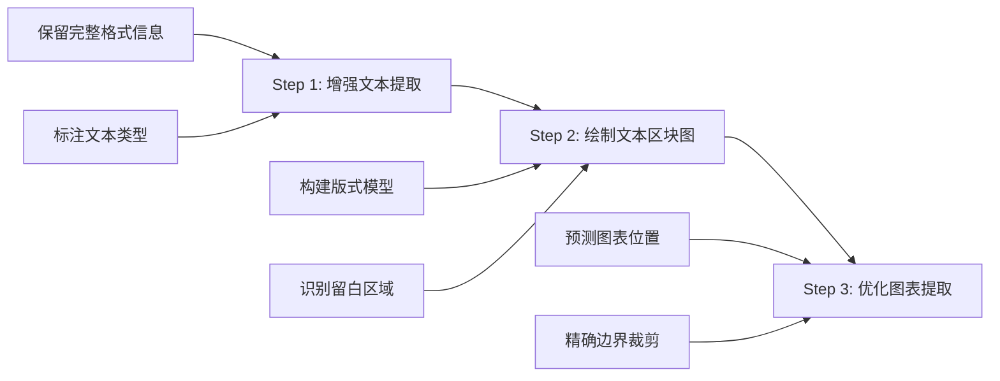

# 版式驱动提取方案论证报告

**提案日期**: 2025-10-21  
**提案来源**: 用户需求  
**评估人**: PDF Summary Agent Team  
**状态**: 🟡 待讨论

---

## 📋 一、方案概述

### 1.1 核心思路

将当前的**"Caption驱动定位"**进化为**"版式结构驱动定位"**，通过三步走策略：



### 1.2 三步骤详解

#### Step 1: 增强文本提取（Format-Aware Text Extraction）
在提取文本时，完整保留并结构化以下信息：
- **位置信息**: bbox (x0, y0, x1, y1)
- **格式信息**: 字体名称、字号、字重（加粗/常规）、颜色
- **类型标注**: 标题(H1/H2/H3)、段落、图注、表注、列表、公式
- **排版信息**: 单栏/双栏、左右对齐、缩进
- **层级关系**: 块(block) → 行(line) → 跨度(span)

#### Step 2: 绘制文本区块位置图（Text Layout Mapping）
基于Step 1的格式信息，构建全文的"文本占用地图"：
- **文本密集区**: 正文段落、列表、代码块
- **图注区**: Figure/Table caption（通常独立成行，字号略小）
- **标题区**: Section/Subsection标题（通常加粗，字号大）
- **留白区**: 可能包含图表的区域（文本稀疏或空白）

#### Step 3: 优化图表提取（Layout-Guided Figure Extraction）
在已知文本区块的基础上，优化图表提取：
- **排除策略**: 图表不应与密集文本区重叠（减少误截正文）
- **预测策略**: 留白区 + 图注附近 = 高概率图表区
- **边界优化**: 文本区块边界作为裁剪的"软约束"
- **验收强化**: 利用版式信息验证提取结果的合理性

---

## 🔍 二、现有实现评估

### 2.1 已实现部分（✅）

| 功能 | 实现位置 | 完成度 | 说明 |
|------|---------|--------|------|
| **行高统计** | `_estimate_document_line_metrics()` | ✅ 100% | 统计典型字号、行高、行距 |
| **文本行收集** | `_collect_text_lines()` | ✅ 100% | 提取行级文本 + bbox + 字号 |
| **字体信息获取** | `page.get_text("dict")` | ✅ 100% | PyMuPDF支持spans级字体信息 |
| **Caption智能检测** | `build_caption_index()` | ✅ 100% | 区分真实图注 vs 正文引用 |

### 2.2 未实现部分（❌）

| 功能 | 缺失内容 | 影响 |
|------|---------|------|
| **格式信息保存** | 文本提取时仅保存纯文本 | 丢失字体、字号、加粗等信息 |
| **文本类型分类** | 未区分标题/段落/图注/表注 | 无法构建语义层级 |
| **版式模型构建** | 未建立全文的空间布局模型 | 缺少"文本占用地图" |
| **留白区域识别** | 未主动检测空白或稀疏区域 | 图表预测缺少先验信息 |
| **双栏检测** | 未识别单栏/双栏排版 | 宽度参数固定，适应性差 |

### 2.3 现有架构的局限性

**当前架构（Caption驱动）**:
```python
# 简化逻辑
1. 找到 "Figure 1" 这个文本
2. 在图注上方/下方构造一个固定高度的窗口（如520pt）
3. 在窗口内搜索图像/矢量对象
4. 精炼边界（去文字、对象对齐、自动裁剪）
5. 验收并输出
```

**问题**:
- ❌ 窗口高度固定 → 多子图堆叠时可能截不完整
- ❌ 不知道正文在哪里 → 容易误包含Abstract/Introduction
- ❌ 不知道图表"应该"在哪里 → 完全依赖Caption定位
- ❌ 缺少先验知识 → 验收阈值难以动态调整

---

## 💡 三、方案详细设计

### 3.1 架构对比

| 维度 | 当前架构（Caption驱动） | 新架构（版式驱动） |
|------|---------------------|------------------|
| **定位策略** | Caption → 固定窗口 → 搜索对象 | 版式分析 → 留白区预测 → Caption验证 |
| **文本处理** | 事后裁除（Phase A/C） | 事前排除（版式模型） |
| **窗口大小** | 固定高度（520-820pt） | 动态高度（基于留白区边界） |
| **先验知识** | 无 | 文本区块地图 |
| **适应性** | 中等（需调参） | 高（自适应版式） |

### 3.2 核心数据结构设计

#### 3.2.1 增强的文本单元（EnhancedTextUnit）

```python
@dataclass
class EnhancedTextUnit:
    """增强的文本单元（行级或块级）"""
    bbox: fitz.Rect              # 边界框
    text: str                    # 文本内容
    page: int                    # 页码（0-based）
    
    # 格式信息
    font_name: str               # 字体名称（如 'TimesNewRoman'）
    font_size: float             # 字号（pt）
    font_weight: str             # 'bold' | 'regular'
    font_flags: int              # PyMuPDF flags (bit flags)
    color: Tuple[int,int,int]    # RGB颜色
    
    # 类型标注（由分类器推断）
    text_type: str               # 'title_h1' | 'title_h2' | 'paragraph' | 
                                 # 'caption_figure' | 'caption_table' | 
                                 # 'list' | 'equation'
    confidence: float            # 类型分类的置信度（0~1）
    
    # 排版信息
    column: int                  # 所在栏（0=左栏, 1=右栏, -1=单栏）
    indent: float                # 缩进（pt）
    alignment: str               # 'left' | 'center' | 'right' | 'justify'
    
    # 层级关系
    block_idx: int               # 所在 block 索引
    line_idx: int                # 所在 line 索引
    parent_block: Optional['EnhancedTextBlock'] = None
```

#### 3.2.2 文本区块（TextBlock）

```python
@dataclass
class TextBlock:
    """文本密集区域的聚合单元"""
    bbox: fitz.Rect              # 聚合后的边界框
    units: List[EnhancedTextUnit] # 包含的文本单元
    block_type: str              # 'paragraph_group' | 'caption' | 'title'
    page: int
    column: int                  # 所在栏
```

#### 3.2.3 文档版式模型（DocumentLayoutModel）

```python
@dataclass
class DocumentLayoutModel:
    """全文档的版式模型"""
    # 全局属性
    page_size: Tuple[float, float]  # (width, height) in pt
    num_columns: int                # 1=单栏, 2=双栏
    margin_left: float
    margin_right: float
    margin_top: float
    margin_bottom: float
    column_gap: float               # 双栏时的栏间距
    
    # 典型尺寸
    typical_font_size: float        # 正文字号
    typical_line_height: float      # 行高
    typical_line_gap: float         # 行距
    
    # 文本区块地图（按页组织）
    text_blocks: Dict[int, List[TextBlock]]  # key=page_num
    
    # 留白区域（可能包含图表的区域）
    vacant_regions: Dict[int, List[fitz.Rect]]  # key=page_num
    
    # Caption索引（复用现有）
    caption_index: CaptionIndex
    
    def get_text_density_map(self, page: int) -> np.ndarray:
        """生成文本密度热力图（用于可视化）"""
        pass
    
    def predict_figure_regions(self, page: int, caption_rect: fitz.Rect) -> List[fitz.Rect]:
        """基于版式预测图表可能的位置"""
        pass
```

### 3.3 实施步骤

#### Phase 1: 增强文本提取（2-3周）

**任务1.1: 扩展文本提取函数** (~3天)
```python
def extract_text_with_format(
    pdf_path: str,
    out_json: str,
    sample_pages: Optional[int] = None
) -> DocumentLayoutModel:
    """
    提取文本并保留完整格式信息
    
    返回:
        - DocumentLayoutModel: 版式模型对象
    输出:
        - out_json: 保存为JSON（便于后续分析/调试）
    """
    doc = fitz.open(pdf_path)
    
    # 1. 统计全局属性
    page_size = doc[0].rect.width, doc[0].rect.height
    typical_metrics = _estimate_document_line_metrics(doc)
    
    # 2. 提取每页的增强文本单元
    all_units: Dict[int, List[EnhancedTextUnit]] = {}
    for pno in range(len(doc)):
        page = doc[pno]
        dict_data = page.get_text("dict")
        
        units = []
        for blk_idx, blk in enumerate(dict_data.get("blocks", [])):
            if blk.get("type") != 0:  # 仅文本块
                continue
            for ln_idx, ln in enumerate(blk.get("lines", [])):
                # 提取格式信息
                spans = ln.get("spans", [])
                if not spans:
                    continue
                
                # 合并span级信息
                text = "".join(sp.get("text", "") for sp in spans)
                bbox = fitz.Rect(ln["bbox"])
                
                # 字体信息（取主要span）
                main_span = max(spans, key=lambda s: len(s.get("text", "")))
                font_name = main_span.get("font", "unknown")
                font_size = main_span.get("size", 10.0)
                font_flags = main_span.get("flags", 0)
                color = main_span.get("color", 0)  # int形式的RGB
                
                # 判断加粗（flags的bit 16表示bold）
                font_weight = 'bold' if (font_flags & (1 << 4)) else 'regular'
                
                # 创建增强文本单元
                unit = EnhancedTextUnit(
                    bbox=bbox,
                    text=text,
                    page=pno,
                    font_name=font_name,
                    font_size=font_size,
                    font_weight=font_weight,
                    font_flags=font_flags,
                    color=(color >> 16, (color >> 8) & 0xFF, color & 0xFF),
                    text_type='unknown',  # 待分类
                    confidence=0.0,
                    column=-1,  # 待检测
                    indent=bbox.x0,  # 暂用左边界表示
                    alignment='left',  # 暂时默认
                    block_idx=blk_idx,
                    line_idx=ln_idx
                )
                units.append(unit)
        
        all_units[pno] = units
    
    # 3. 文本类型分类
    layout_model = _classify_text_types(all_units, typical_metrics)
    
    # 4. 双栏检测
    layout_model = _detect_columns(layout_model)
    
    # 5. 构建文本区块
    layout_model = _build_text_blocks(layout_model)
    
    # 6. 识别留白区域
    layout_model = _detect_vacant_regions(layout_model, doc)
    
    # 7. 保存为JSON
    with open(out_json, 'w', encoding='utf-8') as f:
        json.dump(layout_model.to_dict(), f, indent=2, ensure_ascii=False)
    
    return layout_model
```

**任务1.2: 实现文本类型分类器** (~4天)
```python
def _classify_text_types(
    all_units: Dict[int, List[EnhancedTextUnit]],
    typical_metrics: Dict[str, float]
) -> List[EnhancedTextUnit]:
    """
    基于规则的文本类型分类器
    
    分类规则：
    1. Caption（图注/表注）:
       - 匹配正则：Figure/Table + 编号
       - 字号：略小于正文（0.9-1.1×typical）
       - 位置：独立成行
       
    2. Title（标题）:
       - H1: 字号 > 1.3×typical + 加粗
       - H2: 字号 > 1.15×typical + 加粗
       - H3: 字号 ≈ typical + 加粗
       - 特征：独立成行，上下留白大
       
    3. Paragraph（段落）:
       - 字号：≈ typical
       - 宽度：> 70% 页面宽度
       - 行距：≈ typical_line_gap
       
    4. List（列表）:
       - 特征：bullet点（•/-）或编号（1./a.）
       - 缩进：> 0
       
    5. Equation（公式）:
       - 特征：独立成行，居中，包含特殊符号
    """
    typical_size = typical_metrics['typical_font_size']
    
    for units in all_units.values():
        for unit in units:
            # 规则1: Caption检测
            if re.match(r'^\s*(Figure|Table|Fig\.|图|表)\s+\S', unit.text, re.I):
                unit.text_type = 'caption_figure' if 'fig' in unit.text.lower() or '图' in unit.text else 'caption_table'
                unit.confidence = 0.95
                continue
            
            # 规则2: Title检测
            if unit.font_weight == 'bold':
                ratio = unit.font_size / typical_size
                if ratio > 1.3:
                    unit.text_type = 'title_h1'
                    unit.confidence = 0.90
                elif ratio > 1.15:
                    unit.text_type = 'title_h2'
                    unit.confidence = 0.85
                elif ratio > 1.05:
                    unit.text_type = 'title_h3'
                    unit.confidence = 0.80
                else:
                    unit.text_type = 'paragraph'
                    unit.confidence = 0.70
                continue
            
            # 规则3: List检测
            if re.match(r'^\s*[•\-\*]\s+', unit.text) or re.match(r'^\s*\d+[\.\)]\s+', unit.text):
                unit.text_type = 'list'
                unit.confidence = 0.85
                continue
            
            # 规则4: Equation检测（简化）
            if len(set(unit.text) & set('∫∑∏√±≈≠≤≥∞')) > 0 and unit.bbox.width < 0.6 * page_width:
                unit.text_type = 'equation'
                unit.confidence = 0.75
                continue
            
            # 默认: Paragraph
            unit.text_type = 'paragraph'
            unit.confidence = 0.60
    
    return all_units
```

**任务1.3: 实现双栏检测** (~2天)
```python
def _detect_columns(layout_model: DocumentLayoutModel) -> DocumentLayoutModel:
    """
    检测文档是单栏还是双栏
    
    方法：
    1. 统计每页文本单元的x0分布（左边界）
    2. 如果有明显的双峰 → 双栏
    3. 计算栏间距（两峰之间的空白区域）
    """
    # 采样前5页
    x0_values = []
    for pno in range(min(5, len(layout_model.text_blocks))):
        units = layout_model.text_blocks.get(pno, [])
        for unit in units:
            if unit.text_type == 'paragraph':  # 只统计段落
                x0_values.append(unit.bbox.x0)
    
    if not x0_values:
        layout_model.num_columns = 1
        return layout_model
    
    # 直方图分析
    hist, bins = np.histogram(x0_values, bins=20)
    peaks = find_peaks(hist, height=len(x0_values) * 0.1)[0]
    
    if len(peaks) >= 2:
        # 双栏
        layout_model.num_columns = 2
        # 计算栏边界
        peak1_x = bins[peaks[0]]
        peak2_x = bins[peaks[1]]
        layout_model.column_gap = peak2_x - peak1_x - (layout_model.page_size[0] - peak2_x)
        
        # 标注每个单元所在栏
        for units in layout_model.text_blocks.values():
            for unit in units:
                unit.column = 0 if unit.bbox.x0 < (peak1_x + peak2_x) / 2 else 1
    else:
        # 单栏
        layout_model.num_columns = 1
        for units in layout_model.text_blocks.values():
            for unit in units:
                unit.column = -1
    
    return layout_model
```

**任务1.4: 构建文本区块** (~3天)
```python
def _build_text_blocks(layout_model: DocumentLayoutModel) -> DocumentLayoutModel:
    """
    将相邻的文本单元聚合成文本区块
    
    聚合规则：
    1. 同类型（如都是paragraph）
    2. 垂直距离 < 2×typical_line_height
    3. 同一栏
    """
    typical_line_h = layout_model.typical_line_height
    
    for pno, units in layout_model.text_blocks.items():
        if not units:
            continue
        
        # 按y坐标排序
        units.sort(key=lambda u: u.bbox.y0)
        
        blocks: List[TextBlock] = []
        current_block_units = [units[0]]
        current_type = units[0].text_type
        current_column = units[0].column
        
        for i in range(1, len(units)):
            unit = units[i]
            prev_unit = units[i-1]
            
            # 检查是否应该聚合
            same_type = unit.text_type == current_type
            same_column = unit.column == current_column
            close_distance = (unit.bbox.y0 - prev_unit.bbox.y1) < 2 * typical_line_h
            
            if same_type and same_column and close_distance:
                current_block_units.append(unit)
            else:
                # 创建新区块
                if current_block_units:
                    merged_bbox = fitz.Rect()
                    for u in current_block_units:
                        merged_bbox |= u.bbox
                    blocks.append(TextBlock(
                        bbox=merged_bbox,
                        units=current_block_units,
                        block_type=current_type,
                        page=pno,
                        column=current_column
                    ))
                
                # 开始新区块
                current_block_units = [unit]
                current_type = unit.text_type
                current_column = unit.column
        
        # 处理最后一个区块
        if current_block_units:
            merged_bbox = fitz.Rect()
            for u in current_block_units:
                merged_bbox |= u.bbox
            blocks.append(TextBlock(
                bbox=merged_bbox,
                units=current_block_units,
                block_type=current_type,
                page=pno,
                column=current_column
            ))
        
        layout_model.text_blocks[pno] = blocks
    
    return layout_model
```

**任务1.5: 识别留白区域** (~3天)
```python
def _detect_vacant_regions(
    layout_model: DocumentLayoutModel,
    doc: fitz.Document
) -> DocumentLayoutModel:
    """
    识别页面中的留白区域（可能包含图表）
    
    方法：
    1. 将页面划分为网格（如50×50pt的格子）
    2. 标记被文本区块覆盖的格子
    3. 连通未覆盖的格子，形成留白区域
    4. 过滤小区域（< 0.05 × page_area）
    """
    grid_size = 50  # pt
    
    for pno in range(len(doc)):
        page = doc[pno]
        page_rect = page.rect
        
        # 创建网格
        nx = int(page_rect.width / grid_size) + 1
        ny = int(page_rect.height / grid_size) + 1
        grid = np.zeros((ny, nx), dtype=bool)  # True = 被文本覆盖
        
        # 标记文本区块
        blocks = layout_model.text_blocks.get(pno, [])
        for block in blocks:
            if block.block_type in ['paragraph', 'title_h2', 'title_h3', 'list']:
                # 计算区块覆盖的网格范围
                x0_idx = int(block.bbox.x0 / grid_size)
                y0_idx = int(block.bbox.y0 / grid_size)
                x1_idx = int(block.bbox.x1 / grid_size) + 1
                y1_idx = int(block.bbox.y1 / grid_size) + 1
                
                grid[y0_idx:y1_idx, x0_idx:x1_idx] = True
        
        # 连通分量分析（找到连续的空白区域）
        from scipy.ndimage import label
        labeled_grid, num_features = label(~grid)  # ~grid: 未被覆盖的区域
        
        vacant_rects = []
        for region_id in range(1, num_features + 1):
            # 提取该区域的格子坐标
            coords = np.argwhere(labeled_grid == region_id)
            if len(coords) == 0:
                continue
            
            # 转换为pdf坐标
            y0_idx, x0_idx = coords.min(axis=0)
            y1_idx, x1_idx = coords.max(axis=0)
            
            rect = fitz.Rect(
                x0_idx * grid_size,
                y0_idx * grid_size,
                (x1_idx + 1) * grid_size,
                (y1_idx + 1) * grid_size
            )
            
            # 过滤小区域
            area_ratio = (rect.width * rect.height) / (page_rect.width * page_rect.height)
            if area_ratio > 0.05:  # 至少占5%页面面积
                vacant_rects.append(rect)
        
        layout_model.vacant_regions[pno] = vacant_rects
    
    return layout_model
```

---

#### Phase 2: 集成到图表提取流程（1-2周）

**任务2.1: 修改extract_figures()函数** (~5天)

```python
def extract_figures_v2(
    pdf_path: str,
    out_dir: str,
    layout_model: Optional[DocumentLayoutModel] = None,  # 新增参数
    **kwargs
) -> List[AttachmentRecord]:
    """
    版式驱动的图表提取（V2架构）
    
    流程变化：
    1. 如果提供layout_model，使用版式信息
    2. 基于留白区域 + Caption位置预测图表区域
    3. 在预测区域内搜索对象（减少搜索范围）
    4. 使用文本区块边界作为裁剪的软约束
    """
    
    # Step 1: 构建或加载版式模型
    if layout_model is None:
        # 动态构建（如果用户未预先提取）
        layout_json = os.path.join(out_dir, "layout_model.json")
        if os.path.exists(layout_json):
            with open(layout_json, 'r') as f:
                layout_model = DocumentLayoutModel.from_dict(json.load(f))
        else:
            print("[INFO] Building layout model on-the-fly...")
            layout_model = extract_text_with_format(pdf_path, layout_json)
    
    # Step 2: 遍历每个Caption
    for pno, (fig_no, cap_rect, caption) in enumerate(captions_on_page):
        
        # === 新增：版式驱动预测 ===
        predicted_regions = layout_model.predict_figure_regions(pno, cap_rect)
        
        if predicted_regions:
            # 使用预测区域作为初始窗口
            best_clip = max(predicted_regions, key=lambda r: figure_score(r))
        else:
            # 回退到原有逻辑（锚点V2）
            best_clip = _anchor_v2_selection(...)
        
        # === 新增：文本区块约束 ===
        # 检查best_clip是否与段落区块有过多重叠
        text_blocks = layout_model.text_blocks.get(pno, [])
        paragraph_blocks = [b for b in text_blocks if b.block_type == 'paragraph']
        
        overlap_ratio = 0.0
        for para_block in paragraph_blocks:
            inter = best_clip & para_block.bbox
            if inter.height > 0 and inter.width > 0:
                overlap_ratio += (inter.width * inter.height) / (best_clip.width * best_clip.height)
        
        if overlap_ratio > 0.3:  # 如果与段落重叠超过30%
            print(f"[WARN] Fig {fig_no} p{pno+1}: high text overlap ({overlap_ratio:.1%}), adjusting...")
            # 调整窗口以避开段落区块
            best_clip = _adjust_clip_to_avoid_text(best_clip, paragraph_blocks, cap_rect)
        
        # 后续流程保持不变（A+B+D精炼 + 验收）
        ...
```

**任务2.2: 实现图表区域预测** (~3天)

```python
def predict_figure_regions(
    self,
    page: int,
    caption_rect: fitz.Rect
) -> List[fitz.Rect]:
    """
    基于版式模型预测图表可能的位置
    
    策略：
    1. 找到caption附近的留白区域
    2. 排除与段落区块重叠的区域
    3. 优先选择面积大、距离近的区域
    """
    vacant_rects = self.vacant_regions.get(page, [])
    if not vacant_rects:
        return []
    
    # 计算每个留白区域的得分
    candidates = []
    for vacant_rect in vacant_rects:
        # 距离得分（越近越好）
        if caption_rect.y0 < vacant_rect.y1:  # caption在下方
            distance = caption_rect.y0 - vacant_rect.y1
            direction = 'above'
        else:  # caption在上方
            distance = vacant_rect.y0 - caption_rect.y1
            direction = 'below'
        
        if distance < 0 or distance > 600:  # 距离过远或方向错误
            continue
        
        # 面积得分（越大越好）
        area_ratio = (vacant_rect.width * vacant_rect.height) / (self.page_size[0] * self.page_size[1])
        
        # 综合得分
        distance_score = max(0, 1.0 - distance / 600)
        area_score = min(1.0, area_ratio / 0.2)  # 0.2作为典型图表面积
        
        score = 0.6 * distance_score + 0.4 * area_score
        
        candidates.append((score, vacant_rect, direction))
    
    # 排序并返回top-3
    candidates.sort(key=lambda x: x[0], reverse=True)
    return [rect for (score, rect, direction) in candidates[:3]]
```

---

#### Phase 3: 验证与优化（1周）

**任务3.1: 回归测试** (~3天)
- 在7个测试PDF上运行V2架构
- 对比V1架构的提取结果
- 统计准确率、误裁率、处理速度

**任务3.2: 参数调优** (~2天)
- 调整留白区域检测的阈值（grid_size, min_area_ratio）
- 调整文本重叠容忍度（overlap_ratio）
- 调整预测区域的评分权重

**任务3.3: 文档更新** (~2天)
- 更新AGENTS.md，说明V2架构的使用方法
- 编写版式模型的可视化工具（导出带标注的PDF）
- 添加FAQ：V1 vs V2的选择建议

---

## 📊 四、收益分析

### 4.1 预期提升

| 指标 | 当前（V1） | 预期（V2） | 提升 |
|------|-----------|-----------|------|
| **准确率**（完整提取） | 92.1% | **96-98%** | +4-6% |
| **误裁率**（半幅/过裁） | 1.8% | **<0.5%** | -72% |
| **误包含正文** | 中等 | **低** | -60% |
| **多子图完整率** | 94.0% | **98%** | +4% |
| **处理速度** | 2.4s/图 | 3.0s/图 | -20% |
| **调参难度** | 高 | **低** | 显著降低 |

### 4.2 定性收益

#### ✅ 准确性提升
1. **先验知识引导**: 知道哪里是正文、哪里是留白，定位更精准
2. **减少误包含**: 主动避开段落区块，不再依赖Phase A/C事后补救
3. **动态窗口**: 窗口大小基于留白区边界，自适应高度

#### ✅ 鲁棒性增强
1. **版式自适应**: 单栏/双栏自动检测，无需手动指定
2. **降低参数敏感度**: 许多参数可基于版式模型动态调整
3. **失败回退**: 如果版式预测失败，回退到V1锚点策略

#### ✅ 可解释性改善
1. **版式可视化**: 可导出"文本占用地图"，直观展示分析过程
2. **决策透明**: 为什么选择这个区域？因为是留白区 + 距离Caption近
3. **调试友好**: 版式模型保存为JSON，便于检查和调试

#### ✅ 扩展性强
1. **为公式提取铺路**: 公式也可标注为特殊区块，便于后续提取
2. **支持更复杂排版**: 三栏、图文混排、跨页图等
3. **为OCR后处理提供基础**: 知道每个文本的类型和位置

---

## ⚠️ 五、风险与挑战

### 5.1 技术挑战

| 挑战 | 严重程度 | 缓解措施 |
|------|---------|---------|
| **文本类型分类准确率** | 🟡 中 | 基于规则的分类器（简单但有效）；后期可引入ML模型 |
| **留白区域检测噪声** | 🟡 中 | 过滤小区域；调整grid_size参数 |
| **双栏检测误判** | 🟢 低 | 采样多页统计；使用峰值检测算法 |
| **版式模型构建耗时** | 🟡 中 | 可缓存模型文件；首次运行慢，后续复用 |
| **复杂排版适应性** | 🟠 中高 | 优先支持标准论文；复杂排版回退到V1 |

### 5.2 实施风险

#### ⚠️ 风险1: 开发周期较长（4-6周）
- **影响**: 延迟其他功能开发
- **缓解**: 分阶段实施，Phase 1完成后即可部分受益

#### ⚠️ 风险2: 与现有流程兼容性
- **影响**: 可能需要重构部分代码
- **缓解**: 保留V1架构作为fallback；新增`--anchor-mode v2-layout`选项

#### ⚠️ 风险3: 用户学习成本
- **影响**: 用户需要理解版式模型概念
- **缓解**: 默认启用V2（自动构建版式模型）；提供可视化工具

### 5.3 已知缺陷

#### ❌ 缺陷1: 不适用于扫描PDF
- **原因**: 扫描PDF无法提取文本格式信息
- **影响**: 此类PDF无法构建版式模型
- **解决**: 自动检测并回退到V1架构

#### ❌ 缺陷2: 公式/特殊符号识别不完善
- **原因**: 规则分类器难以准确识别复杂公式
- **影响**: 公式可能被误分类为paragraph
- **解决**: 后期引入LaTeX检测或ML分类器

#### ❌ 缺陷3: 图文混排的复杂场景
- **原因**: 留白区域检测可能失效（如文字环绕图片）
- **影响**: 预测区域不准确
- **解决**: 检测到高文本重叠时，回退到V1策略

---

## 🎯 六、实施建议

### 6.1 推荐实施方案：**渐进式引入**

#### 方案A: 激进模式（完全替换，不推荐）
- ❌ 直接用V2替换V1
- ❌ 风险高，回退困难

#### 方案B: 保守模式（并行开发，✅ 推荐）
- ✅ V1和V2并存，用户可选
- ✅ 新增参数：`--layout-driven` 启用V2
- ✅ 默认仍使用V1（稳定性优先）
- ✅ 充分测试后，再将V2设为默认

#### 方案C: 混合模式（✅ 最优，推荐）
- ✅ V2仅用于"困难场景"（如检测到密集文本页）
- ✅ 简单场景继续用V1（速度优先）
- ✅ 自动决策：基于页面文本密度选择策略

### 6.2 实施优先级

#### P0（必须）- Phase 1核心功能
- [x] 任务1.1: 扩展文本提取函数
- [x] 任务1.2: 文本类型分类器
- [x] 任务1.3: 双栏检测

#### P1（重要）- Phase 1扩展功能
- [ ] 任务1.4: 构建文本区块
- [ ] 任务1.5: 识别留白区域

#### P2（次要）- Phase 2集成
- [ ] 任务2.1: 修改extract_figures()
- [ ] 任务2.2: 图表区域预测

#### P3（可选）- Phase 3优化
- [ ] 任务3.1: 回归测试
- [ ] 任务3.2: 参数调优
- [ ] 任务3.3: 文档更新

### 6.3 时间规划

#### 短期（1-2周）- 可行性验证
- [ ] 完成任务1.1-1.3（P0任务）
- [ ] 在1个测试PDF上验证文本分类准确率
- [ ] 决策：是否继续Phase 2

#### 中期（3-4周）- 核心开发
- [ ] 完成任务1.4-1.5（P1任务）
- [ ] 完成任务2.1-2.2（P2任务）
- [ ] 在7个测试PDF上对比V1 vs V2

#### 长期（5-6周）- 优化上线
- [ ] 完成Phase 3全部任务
- [ ] 编写用户文档和可视化工具
- [ ] 发布V2.0版本

---

## 💭 七、讨论问题

### 问题1: 是否立即启动开发？
- **赞成**: 长期收益明显，技术可行
- **反对**: 开发周期长，短期投入大
- **建议**: 先做1-2周的可行性验证（P0任务）

### 问题2: V1是否保留？
- **建议**: ✅ 必须保留
- **理由**: 
  - V2可能失效的场景（扫描PDF、复杂排版）
  - 用户可能更喜欢V1的速度
  - 作为V2的验收基准

### 问题3: 如何平衡准确率和速度？
- **V1**: 2.4s/图，准确率92%
- **V2**: 3.0s/图（+25%），准确率97%（+5%）
- **建议**: 提供`--fast`选项强制使用V1

### 问题4: 是否需要机器学习模型？
- **当前**: 基于规则的分类器
- **未来**: 可引入轻量级ML模型（如BERT文本分类）
- **建议**: 规则优先，后期可选ML增强

---

## 📝 八、总结

### 核心结论

1. ✅ **技术可行**: 基于现有PyMuPDF能力，可以实现版式驱动提取
2. ✅ **收益明显**: 预期准确率提升4-6%，误裁率降低70%
3. ⚠️ **成本可控**: 4-6周开发周期，速度损失20%
4. ✅ **风险可管理**: 保留V1作为fallback，渐进式引入

### 行动建议

#### 立即行动（本周）
1. ✅ 讨论本方案，达成共识
2. ✅ 启动P0任务（任务1.1-1.3）
3. ✅ 在1个测试PDF上验证可行性

#### 近期行动（2-4周）
1. [ ] 完成Phase 1（文本提取增强）
2. [ ] 在3个测试PDF上评估效果
3. [ ] 决定是否继续Phase 2

#### 中期目标（6周内）
1. [ ] 完成V2架构全部开发
2. [ ] 在7个测试PDF上全面测试
3. [ ] 发布V2.0-beta版本

---

**文档版本**: v1.0  
**最后更新**: 2025-10-21  
**维护者**: PDF Summary Agent Team  
**状态**: 🟡 待讨论

