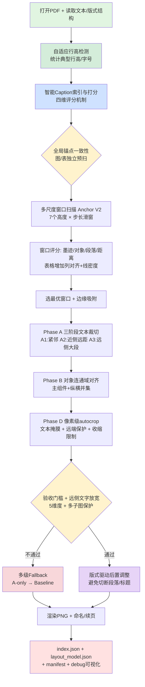
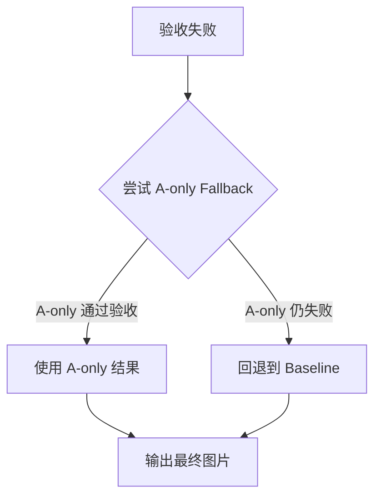

# PDF 图表提取脚本技术总结

**文档日期**: 2025-10-25  
**脚本版本**: extract_pdf_assets.py v2.5 (Layout-Driven Enhanced)  
**文档类型**: 综合技术总结  
**状态**: ✅ 生产就绪  
**最后更新**: 2025-10-25

---

## 📋 文档目的

本文档是 `pdf-summary-agent` 项目核心脚本 `extract_pdf_assets.py` 的**综合技术总结**，涵盖：
- 完整的业务流程与架构设计
- 关键技术模块的实现细节与代码位置
- 参数配置策略与调优指南
- 已知问题、解决方案与最佳实践
- 性能基准与工具对比

**目标读者**: 开发者、代码审查者、高级用户

---

## 🎯 总体概览

### 核心能力

`extract_pdf_assets.py` 是一个基于 **PyMuPDF (fitz)** 和 **pdfminer.six** 的学术论文图表提取工具，采用**多阶段渐进式精炼**策略，实现：

1. ✅ **文本提取**: 全文 UTF-8 文本 + 完整版式信息（字体/字号/颜色/行高/分栏）
2. ✅ **智能 Caption 检测**: 四维评分区分真实图注 vs 正文引用（准确率 ~95%）
3. ✅ **全局锚点一致性**: 预扫描决定整篇图/表的统一方向（ABOVE/BELOW），图表独立评分
4. ✅ **多尺度锚点扫描 (Anchor V2)**: 7 个高度 × 步长滑窗，结构化评分选最优窗口
5. ✅ **渐进式精炼 (A+B+D)**: 文本裁切（三阶段）→ 对象对齐 → 像素级自动裁剪，逐步优化边界
6. ✅ **自适应行高**: 自动检测文档行高/字号，动态调整裁切阈值（支持单栏/双栏）
7. ✅ **版式驱动后置调整 (V2)**: 利用文档布局模型避免切断段落/标题
8. ✅ **验收保护 + 多级 Fallback**: 5 维度质量门槛 + 远侧文字放宽，不达标自动回退（A-only → Baseline）
9. ✅ **可视化调试**: 生成彩色边界框叠加图 + 文字图例，支持全流程审查（含版式区块）

### 技术架构



### 关键文件位置

| 模块 | 文件路径 | 说明 |
|------|---------|------|
| **主脚本** | `scripts/extract_pdf_assets.py` | 全部逻辑（5103 行，含完整注释） |
| **工作流指南** | `AGENTS.md` | 面向大模型的使用指南（523 行） |
| **项目说明** | `README.md` | 项目概览与快速开始 |
| **依赖清单** | `scripts/requirements.txt` | Python 依赖（pymupdf, pdfminer.six） |
| **分析工具** | `scripts/analyze_extraction.py` | 提取结果统计分析 |
| **诊断工具** | `scripts/diagnose_funaudio.py` | 复杂案例调试（已归档） |

---

## 🔬 核心技术模块详解

### 模块 1: 文本与版式信息提取

#### 1.1 全文文本提取

**入口函数**: `try_extract_text()`  
**代码位置**: `scripts/extract_pdf_assets.py:82-100`

**功能**:
- 使用 `pdfminer.six` 提取 PDF 全文为 UTF-8 纯文本
- 输出到 `--out-text` 指定路径（默认 `<pdf_dir>/text/<paper>.txt`）
- 失败时不影响图表提取流程（优雅降级）

**实现要点**:
```python
from pdfminer.high_level import extract_text

try:
    text = extract_text(pdf_path)
    with open(out_text, "w", encoding="utf-8") as f:
        f.write(text)
    print(f"[INFO] Wrote text: {out_text} (chars={len(text)})")
except Exception as e:
    print(f"[WARN] Text extraction failed: {e}")
```

**应用场景**:
- 质量检查（QC）：统计 `Figure`/`Table` 出现次数与提取数量对比
- 生成摘要：将文本 + 图表一并喂给大模型
- 版式分析：为智能 Caption 检测提供上下文

---

#### 1.2 增强版式信息提取

**入口函数**: `extract_text_with_format()`  
**代码位置**: `scripts/extract_pdf_assets.py:4578-4729`

**功能**:
1. **提取增强文本单元** (`EnhancedTextUnit`)
   - **位置信息**: bbox（边界框）、page（页码）
   - **格式信息**: font_name、font_size、font_weight、font_flags、color（RGB）
   - **类型标注**: text_type（9种类型：标题h1/h2/h3、段落、Caption图/表、列表、公式、图内文字）
   - **分栏信息**: column（-1=单栏，0=左栏，1=右栏）
   - **置信度**: confidence（分类器的置信度评分）

2. **构建文档布局模型** (`DocumentLayoutModel`)
   - **全局属性**: page_size、num_columns、margins、column_gap
   - **典型尺寸**: typical_font_size（正文字号）、typical_line_height（行高）、typical_line_gap（行距）
   - **文本单元**: text_units（按页组织的 EnhancedTextUnit 列表）
   - **文本区块**: text_blocks（段落组/标题/列表的聚合单元，用于版式调整）
   - **留白区域**: vacant_regions（可能包含图表的空白区域，网格化检测）

3. **持久化输出**
   - 保存为 JSON：`--layout-json <path>` 或默认 `<out_dir>/layout_model.json`
   - 防崩溃保护：仅在目录非空时创建（修复 P1 bug，Line 4729）
   - 支持序列化/反序列化（`to_dict()` / `from_dict()`）

**关键子函数**:

| 函数名 | 位置 | 功能 | 输入 | 输出 |
|--------|------|------|------|------|
| `_estimate_document_line_metrics()` | Line 583-715 | 统计典型行高/字号/行距（采样前 5 页） | doc, sample_pages | Dict[str, float] |
| `_classify_text_types()` | Line 3941-4065 | 文本单元分类（9 种类型） | units, typical_metrics | 更新 units.text_type |
| `_detect_columns()` | Line 4067-4157 | 双栏检测（x0 直方图聚类） | units, page_width | int (1 or 2) |
| `_build_text_blocks()` | Line 4159-4274 | 文本区块聚合（段落组/标题） | units, page_size | List[TextBlock] |
| `_detect_vacant_regions()` | Line 4276-4366 | 留白区域识别（网格化 + 连通分量） | text_blocks, page_size | List[Rect] |

**实现亮点**:

**文本分类规则** (`_classify_text_types`)：
```python
# Caption: 以 "Figure/Table/图/表 + 编号" 开头
if re.match(r"^\s*(?:Figure|Table|图|表)\s+\d+", text):
    text_type = 'caption_figure' or 'caption_table'

# Title: 加粗 + 相对大字号
if is_bold and (font_size > typical_font_size * 1.15):
    text_type = 'title_h1' / 'title_h2' / 'title_h3'

# In-Figure Text: 字体不同 + 字号偏小 + 短文本 + 窄宽度
if (font_name != typical_font_name and 
    font_size < typical_font_size * 0.9 and 
    len(text) < 30 and 
    bbox.width < page_width * 0.4):
    text_type = 'in_figure'
```

**双栏检测** (`_detect_columns`)：
```python
# 统计段落单元 x0 的直方图（bin_size=10pt）
histogram = defaultdict(int)
for unit in paragraph_units:
    bin_idx = int(unit.bbox.x0 / 10.0)
    histogram[bin_idx] += 1

# 寻找两个显著峰值（间隔 > page_width / 3）
peaks = find_peaks(histogram, min_height=5, min_distance=page_width / 30)
num_columns = 2 if len(peaks) >= 2 else 1
```

**留白区域识别** (`_detect_vacant_regions`)：
```python
# 1. 网格化页面（50pt × 50pt）
grid = create_grid(page_size, cell_size=50)

# 2. 标记被文本区块覆盖的格子
for block in text_blocks:
    mark_covered_cells(grid, block.bbox)

# 3. 连通分量分析 + 面积过滤
vacant_regions = []
for component in find_connected_components(grid):
    if component.area > 0.05 * page_area:  # > 5% 页面
        vacant_regions.append(component.bbox)
```

---

#### 1.3 自适应行高检测

**功能**: 自动适配不同 PDF 的行高差异（单栏 vs 双栏，10pt vs 14pt 正文）

**核心函数**: `_estimate_document_line_metrics()`  
**代码位置**: `scripts/extract_pdf_assets.py:583-715`

**采样策略**:
1. 前 5 页（或 `--sample-pages` 指定）
2. 统计所有段落文本行的 y 间距 → **中位数**作为 `typical_line_height`（更稳健）
3. 统计字号分布（8-14pt 范围）→ **中位数**作为 `typical_font_size`
4. 计算行距 = 行高 - 字号
5. 过滤异常值（高度 <3pt 或宽度 <10pt）

**动态调整阈值**（基于行高倍数）:
```python
# Phase A: 紧邻文本（默认 24pt → 2.0×行高）
adjacent_th = 2.0 * typical_line_height  # 约 2 行

# Phase C: 远距段落检测（默认 300pt → 10.0×行高）
far_text_th = 10.0 * typical_line_height  # 约 10 行
far_side_min_dist = 8.0 * typical_line_height  # 约 8 行

# Phase A: 裁切间距（默认 6pt → 0.5×行高）
text_trim_gap = 0.5 * typical_line_height  # 约半行

# Phase B: 对象合并间距（默认 6pt → 0.5×行高）
object_merge_gap = 0.5 * typical_line_height  # 约半行
```

**效果示例** (KearnsNevmyvakaHFTRiskBooks.pdf):
- 检测到典型行高: 10.9pt（双栏论文）
- 自适应参数: `adjacent_th=21.8pt`, `far_text_th=109.0pt`
- Table 1: 成功移除顶部 120pt 文字（约 11 行，包含 2 行正文 + 空白）

**启用/禁用**:
```bash
# 默认启用（随 --preset robust 自动启用）
python3 scripts/extract_pdf_assets.py --pdf paper.pdf --preset robust

# 禁用（回退固定参数，不推荐）
python3 scripts/extract_pdf_assets.py --pdf paper.pdf --no-adaptive-line-height
```

**调试输出**:
```bash
# 查看行高统计详情
python3 scripts/extract_pdf_assets.py --pdf paper.pdf --preset robust --debug-captions
# 输出示例:
# [INFO] Adaptive line height: typical_line_height=10.9pt, typical_font_size=9.0pt
# [INFO] Adjusted thresholds: adjacent_th=21.8pt, far_text_th=109.0pt
```

---

### 模块 2: 智能 Caption 检测

**问题背景**: 论文中的图表标号（如 `Figure 1`、`Table 2`）可能出现在三种位置：
1. **真实图注**: 紧邻图表上方或下方，作为图注首次出现（期望情况）
2. **前文引用**: 在图表之前的正文中提前引用和说明（如"如图1所示"）
3. **混合情况**: 图注、前文、后文都出现该标号

**核心思路**: 预扫描全文，为每个编号的所有出现位置打分，选择得分最高的作为真实图注。

**支持范围**:
- ✅ 图片: `Figure 1-99`, `Figure S1-S9`, `Figure I-V`（罗马数字）
- ✅ 表格: `Table 1-99`, `Table S1-S9`, `Table I-V`, `Table A1-A9`（附录表）
- ✅ 中文: `图 1-99`, `表 1-99`

#### 2.1 候选项收集

**函数**: `find_all_caption_candidates()`  
**位置**: `scripts/extract_pdf_assets.py:1518-1579`

**流程**:
```python
for page in doc:
    dict_data = page.get_text("dict")
    for block in dict_data["blocks"]:
        for line in block["lines"]:
            text = extract_text_from_spans(line["spans"])
            match = pattern.match(text)  # Figure/Table + 编号（支持罗马数字/附录）
            if match:
                candidate = CaptionCandidate(
                    rect=line["bbox"],           # 位置
                    text=text,                   # 完整文本
                    number=match.group(1),       # 编号（如 "1", "S1", "III"）
                    kind='figure' or 'table',    # 类型
                    page=page_num,               # 页码
                    spans=line["spans"],         # 保留字体信息（用于格式评分）
                    block=block,                 # 保留上下文（用于结构评分）
                    line_idx=line_idx            # 行索引（用于获取下一行）
                )
                candidates.append(candidate)
```

**正则模式**（支持复杂编号）:
```python
# 图片模式（支持罗马数字 I-V）
figure_pattern = re.compile(
    r"^\s*(?:Figure|图)\s+([SIVXivx\d]+(?:\.\d+)?)",
    re.IGNORECASE
)

# 表格模式（支持附录表 A1-A9）
table_pattern = re.compile(
    r"^\s*(?:Table|表)\s+([SIVXivxA-Z]?\d+(?:\.\d+)?)",
    re.IGNORECASE
)
```

---

#### 2.2 四维评分机制

**函数**: `score_caption_candidate()`  
**位置**: `scripts/extract_pdf_assets.py:1581`

**评分公式** (总分 100):

| 维度 | 权重 | 评分规则 | 代码逻辑 |
|------|------|---------|---------|
| **位置特征** | 40 分 | 距离图像/绘图对象越近得分越高 | `min_dist < 10pt → 40分`<br>`10-20pt → 35分`<br>`20-40pt → 28分`<br>`40-80pt → 18分`<br>`80-150pt → 8分` |
| **格式特征** | 30 分 | 加粗(15分) + 独立成段(10分) + 后续标点(5分) | 检查 `font_flags & 2^4` (加粗)<br>检查 block 行数<br>检查冒号/句点 |
| **结构特征** | 20 分 | 下一行有描述(12分) + 段落长度(8分) | 下一行非空 → +12分<br>段落 >240 字符 → -8分 |
| **上下文特征** | 10 分 | 图注关键词(+10) vs 引用关键词(-15) | `"展示/显示/对比"` → +10分<br>`"如图/见图/参见"` → -15分 |

**实现代码**:
```python
def score_caption_candidate(candidate, images, drawings, debug=False):
    score = 0.0
    
    # 1. 位置特征 (40分)
    all_rects = images + drawings
    min_dist = min_distance_to_rects(candidate.rect, all_rects)
    if min_dist < 10:
        score += 40
    elif min_dist < 20:
        score += 35
    # ...
    
    # 2. 格式特征 (30分)
    if is_bold_text(candidate.spans):
        score += 15
    if len(candidate.block.get("lines", [])) == 1:
        score += 10  # 独立成段
    if re.search(r"[:.。]", candidate.text):
        score += 5
    
    # 3. 结构特征 (20分)
    next_line_text = get_next_line_text(candidate.block, candidate.line_idx)
    if next_line_text and len(next_line_text) > 10:
        score += 12
    para_length = get_paragraph_length(candidate.block)
    if para_length > 240:
        score -= 8
    
    # 4. 上下文特征 (10分)
    if is_likely_caption_context(candidate.text):
        score += 10  # "展示/显示/对比"
    if is_likely_reference_context(candidate.text):
        score -= 15  # "如图/见图/参见"
    
    return score
```

---

#### 2.3 最佳候选选择

**函数**: `select_best_caption()`  
**位置**: `scripts/extract_pdf_assets.py:1751`

**策略**:
1. 对所有候选打分
2. 选择得分 ≥ `min_score_threshold` (默认 25.0) 的最高分候选
3. 如果所有候选 < 25分，拒绝该编号（避免误匹配）

**调试模式**:
```bash
--debug-captions  # 输出所有候选项评分详情
```

**输出示例**:
```
[INFO] SMART CAPTION DETECTION (Figures)
  Found 2 candidates for Figure 4 on page 6:
    Candidate 1: y=586.4, score=52.0 (position=28.0, format=8.0, structure=16.0, context=0.0)
    Candidate 2: y=626.5, score=37.0 (position=18.0, format=8.0, structure=16.0, context=-15.0)
  Selected: Candidate 1 (真实图注)
```

---

#### 2.4 全文索引构建

**函数**: `build_caption_index()`  
**位置**: `scripts/extract_pdf_assets.py:1806`

**流程**:
```python
caption_index = CaptionIndex(candidates={})

for page_num in range(len(doc)):
    page = doc[page_num]
    
    # 收集所有候选（图 + 表）
    fig_candidates = find_all_caption_candidates(page, page_num, figure_pattern, 'figure')
    table_candidates = find_all_caption_candidates(page, page_num, table_pattern, 'table')
    
    # 归档到索引
    for cand in fig_candidates:
        key = f"figure_{cand.number}"
        caption_index.candidates.setdefault(key, []).append(cand)
    
    for cand in table_candidates:
        key = f"table_{cand.number}"
        caption_index.candidates.setdefault(key, []).append(cand)

return caption_index
```

**应用场景**:
- 图片提取: `extract_figures(..., smart_caption_detection=True)`
- 表格提取: `extract_tables(..., smart_caption_detection=True)`

---

### 模块 3: 全局锚点一致性

**问题背景**: 同一文档中的图表可能采用不同排版风格（图注在上 vs 在下），单页判断可能误判。

**核心思路**: 预扫描整篇文档的所有图/表，统计"上方得分总和" vs "下方得分总和"，决定统一方向。

#### 3.1 图片全局锚点

**代码位置**: `scripts/extract_pdf_assets.py:2005`（在 `extract_figures` 主循环前）

**评分公式**:
```python
score = 0.6 * ink_ratio + 0.4 * object_coverage
```

**决策规则**:
```python
if below_total > above_total * (1.0 + global_anchor_margin):
    global_side = 'below'  # 图注在下方
elif above_total > below_total * (1.0 + global_anchor_margin):
    global_side = 'above'  # 图注在上方
else:
    global_side = 'auto'  # 每个图单独决策
```

**默认参数**:
- `--global-anchor-margin 0.02`: 阈值 2%

**日志示例**:
```
[INFO] Global figure anchor: ABOVE (above=2.85 vs below=1.92)
→ 本篇所有图统一采用"图注在下方，图在上方"裁剪
```

---

#### 3.2 表格全局锚点（独立预扫）

**代码位置**: `scripts/extract_pdf_assets.py:3240`（在 `extract_tables` 主循环前）

**评分公式** (表格专用):
```python
score = (0.4 * ink_ratio +
         0.25 * column_alignment_peaks +  # 列对齐峰值
         0.2 * line_density +             # 线段密度
         0.15 * object_ratio)
```

**差异说明**:
- 表格更看重**列对齐**和**线段密度**（表格特征）
- 阈值更宽松：`--global-anchor-table-margin 0.03`（3% vs 图片的 2%）

**原因**: 表格排版更灵活，需要更大的容错空间

---

#### 3.3 与强制方向的关系

**优先级**:
1. `--above N` / `--below N`: **最高优先级**，直接指定编号 N 的方向
2. 全局锚点: 中等优先级，影响所有未被强制指定的图/表
3. Anchor V2 自动判断: 最低优先级

**注意**: 
- 当使用默认 `--anchor-mode v2` 时，`--above/--below` 不生效
- 如需按编号强制方向，添加 `--anchor-mode v1` 后再结合 `--above/--below`

---

### 模块 4: Anchor V2 多尺度窗口扫描

**核心思路**: 围绕 Caption 多尺度滑窗，结合结构打分，选择最优窗口。

#### 4.1 扫描策略

**参数**:
- `--scan-heights`: 默认 `240,320,420,520,640,720,820`（7 个高度）
- `--scan-step`: 默认 `14pt`（步长）
- `--caption-mid-guard`: 默认 `6pt`（中线护栏，防跨相邻图注）

**上方扫描逻辑**:
```python
for height in scan_heights:
    y1 = cap_rect.y0 - caption_gap  # 固定底边
    y0_min = max(page_rect.y0, 上一个图注底部, 中线护栏)
    y0 = max(y0_min, y1 - height)
    
    while y0 + 40 <= y1:  # 最小窗口高度 40pt
        candidate = Rect(x_left, y0, x_right, y1)
        score = figure_score(candidate) - distance_penalty
        candidates.append((score, 'above', candidate))
        y0 -= scan_step
        if y0 < y0_min:
            break
```

**下方扫描逻辑**:
```python
for height in scan_heights:
    y0 = cap_rect.y1 + caption_gap  # 固定顶边
    y1_max = min(page_rect.y1, 下一个图注顶部, 中线护栏)
    y1 = min(y1_max, y0 + height)
    
    while y1 - 40 >= y0:
        candidate = Rect(x_left, y0, x_right, y1)
        score = table_score(candidate) - distance_penalty
        candidates.append((score, 'below', candidate))
        y0 += scan_step
        y1 = min(y1_max, y0 + height)
        if y0 >= y1_max:
            break
```

---

#### 4.2 图片评分公式

**代码位置**: `scripts/extract_pdf_assets.py:2336`

**公式**:
```python
base_score = (0.55 * ink_ratio +             # 墨迹密度（主要）
              0.25 * object_coverage -       # 对象覆盖率
              0.20 * paragraph_ratio +       # 段落占比（惩罚）
              0.08 * min(1.0, comp_count / 3))  # 组件数量奖励
              
distance_penalty = scan_dist_lambda * (distance / page_height)
final_score = base_score - distance_penalty
```

**指标解释**:
- **墨迹密度**: 低分辨率渲染后非白色像素占比（子采样估计）
- **对象覆盖率**: 位图/矢量对象与窗口交集的面积占比
- **段落占比**: 窗口内段落文字的覆盖率（越高越不像图）
- **组件数量**: 连通域数量（3+ 组件额外加分，鼓励捕获多子图）
- **距离罚项**: 窗口中心距 Caption 的距离（越远惩罚越大）

**参数调优**:
- `--scan-dist-lambda 0.12`: 距离罚项权重
  - 越大: 越倾向选择紧邻图注的窗口
  - 越小: 距离影响减弱，更看重内容质量

---

#### 4.3 表格评分公式（独立优化）

**代码位置**: `scripts/extract_pdf_assets.py:3499`

**公式**:
```python
base_score = (0.5 * ink_ratio +              # 墨迹密度
              0.2 * column_alignment_norm -  # 列对齐峰归一化
              0.15 * line_density +          # 线段密度
              0.15 * object_ratio -          # 对象占比
              0.25 * paragraph_ratio)        # 段落占比（惩罚）
              
final_score = base_score - distance_penalty
```

**新增指标**:
- **列对齐峰**: 统计文本行 x0 的直方图，峰值数量反映表格列数
- **线段密度**: 横向线段（表格线）在窗口中的密度

**原因**: 表格的视觉特征不同于图片，需要专用评分

---

#### 4.4 边缘吸附（Snap to Edges）

**函数**: `snap_clip_edges()`  
**位置**: `scripts/extract_pdf_assets.py:1377`

**功能**: 将选定窗口的上下边界吸附到最近的横向线段（±14pt 范围）

**应用场景**: 对齐表格的顶线和底线，避免半行裁切

---

### 模块 5: 渐进式精炼 (A+B+D)

#### Phase A: 文本邻接裁切（三阶段）

**函数**: `_trim_clip_head_by_text_v2()`  
**位置**: `scripts/extract_pdf_assets.py:807-1163`

**核心思路**: 分层移除不同距离的文字，从近到远逐步裁切，避免误裁图表内容。

---

##### Phase A1: 移除紧邻文字 (<2 行，默认 ~24pt)

**检测条件**:
- 宽度占比 ≥ `--text-trim-width-ratio` (默认 0.5，即 50% 页宽)
- 字体大小在 `--text-trim-font-min` ~ `--text-trim-font-max` (默认 7~16pt)
- 距离图注 ≤ `--adjacent-th` (默认 24pt，或 **2.0×行高**，自适应)

**裁切策略**:
- **方向 = ABOVE**: 向上收缩底边 (y1)，移除图注上方的紧邻文字
- **方向 = BELOW**: 向下收缩顶边 (y0)，移除图注下方的紧邻文字
- **安全限制**: 最多裁除 25% 原始窗口高度

**典型场景**: 移除图注与图片之间的页眉、页码、章节标题等

---

##### Phase A2 (Near-side): 移除近侧远距文字 (2~10 行，默认 24~300pt)

**检测条件**:
- 距离图注: `adjacent_th < 距离 ≤ far_text_th` (默认 24~300pt，或 **2~10 行**，自适应)
- 位于**近侧区域**（近侧 = 靠近图注的 50% 区域）
- 段落覆盖率 ≥ `--far-text-para-min-ratio` (默认 0.30，即 30%)

**裁切模式**:
- `--far-text-trim-mode aggressive` (默认): 移除所有远距段落（更激进）
- `--far-text-trim-mode conservative`: 仅当段落连续时才移除（行间距 <20pt，更保守）

**安全限制**: 最多裁除 60% 原始窗口高度

**典型场景**: 移除图注与图片之间的多行说明文字、引用段落等

---

##### Phase A3 (Far-side): 移除远侧大段正文 (>8 行，默认 >100pt)

**核心创新**: 利用**全局锚点方向**，自动识别多余文字可能出现的方向
- 图注在下方 → 多余文字通常在上方（far side = top）
- 图注在上方 → 多余文字通常在下方（far side = bottom）

**主流程**（基于段落覆盖率）:

**检测条件**:
- 距离图注 > `--far-side-min-dist` (默认 100pt，或 **8.0×行高**，自适应)
- 位于**远侧区域**（远侧 = 远离图注的 50% 区域）
- 段落覆盖率 ≥ `--far-side-para-min-ratio` (默认 0.20，即 20%)

**裁切策略**:
- 如果远侧段落覆盖率 ≥20%，移除所有远侧段落
- **安全限制**: 最多裁除 50% 原始窗口高度

**Fallback 流程**（基于文本特征）:

如果主流程条件不满足（覆盖率 <20%），使用分层判据：
```python
# Bullet 点（•/·/-）: 距离 >15pt → 移除
# 超长文本（>60 字符）: 距离 >18pt → 移除
# 长文本（>30 字符）: 距离 >20pt → 移除
# 普通文字: 距离 >25pt → 移除
```

**效果示例** (FunAudio-ASR.pdf):
- Figure 1: 上方 Abstract 移除，高度减少 138px (-13.4%)
- Figure 3: 上方正文移除，高度减少 311px (-39.0%)
- Table 3: 上方正文移除，高度减少 222px (-30.8%)

**典型场景**: 移除图片上方的 Abstract、Introduction 等大段正文

---

#### Phase B: 对象连通域引导裁切

**函数**: `_refine_clip_by_objects()`  
**位置**: `scripts/extract_pdf_assets.py:1165-1260`

**核心思路**: 基于 PDF 内部对象（位图/矢量图）的分布，精确对齐图表边界。

**流程**:
1. **收集对象**: 筛选窗口内面积占比 ≥ `--object-min-area-ratio` 的对象
   - 图片: 默认 0.012（1.2% 窗口面积）
   - 表格: 默认 0.005（0.5% 窗口面积，更宽松）
2. **合并连通域**: 将距离 ≤ `--object-merge-gap` 的对象合并
   - 图片: 默认 6pt（或 **0.5×行高**，自适应）
   - 表格: 默认 4pt（更紧凑）
3. **选择主组件**: 选择距离图注最近的组件（避免误选远处对象）
4. **纵向/横向并集**: 如果有多个垂直/水平堆叠的组件，取并集（保护多子图）
5. **调整边界**:
   - `--refine-near-edge-only` (default: True): 仅调整靠近图注的边（更安全）
   - `--refine-near-edge-only` = False: 调整所有边（风险：可能过度收缩）

**关键参数**:
- `--object-pad 8`: 对象周围的 padding（pt）
- `--object-min-area-ratio`: 最小面积比（图片 0.012, 表格 0.005）
- `--object-merge-gap`: 合并间距（图片 6pt, 表格 4pt）

**远端边缘外扩**（防半幅截断）:
- 检测远端边（远离图注一侧）有对象紧贴（≤2pt）
- 自动向外扩展 60pt，最多 200pt，补齐整幅
- 典型场景: 图片被 Phase A 过度裁切，通过对象分布恢复完整边界

---

#### Phase D: 文本掩膜辅助自动裁剪

##### D1: 文本掩膜构建（可选）

**函数**: `_build_text_masks_px()`  
**位置**: `scripts/extract_pdf_assets.py:1262`

**功能**: 在自动裁剪前，标记段落文字区域为"白色"（忽略墨迹）

**检测范围**: 仅限近侧区域（`--mask-top-frac` 默认 60%）

**条件**:
- `--autocrop-mask-text` (图片默认 True，表格默认 False)
- `--mask-font-max 14`: 最大字体
- `--mask-width-ratio 0.5`: 最小宽度占比

**应用**: 避免段落文字被误认为"墨迹"，导致去白边失败

---

##### D2: 像素级白边检测

**函数**: `detect_content_bbox_pixels()`  
**位置**: `scripts/extract_pdf_assets.py:177`

**流程**:
1. 按行/列子采样扫描（步长 = max(1, w//1000)）
2. 检测非白色像素（RGB < `--autocrop-white-th` 250）
3. 收缩到包围盒 + `--autocrop-pad` 像素 padding

---

##### D3: 远端边缘保护

**功能**: 在远端边（远离图注一侧）额外扩展，避免轻微过裁

**参数**: `--protect-far-edge-px` (图片 18px, 表格 10px)

---

##### D4: 收缩限制与最小高度

**功能**: 防止自动裁剪过度收缩

**参数**:
- `--autocrop-shrink-limit 0.30`: 最多收缩 30% 面积
- `--autocrop-min-height-px 80`: 最小高度

**调整策略**: 如果收缩过度，向近侧边（靠近图注）扩展回去

---

##### D5: 近侧边缘回扩

**功能**: 在近侧边（靠近图注一侧）额外扩展，避免裁掉坐标轴/标签

**参数**: `--near-edge-pad-px 32`

**限制**: 不得越过图注边界（`cap_rect.y0 - caption_gap*0.5`）

---

### 模块 6: 验收保护 + 多级 Fallback

#### 6.1 远侧文字覆盖率检测（动态放宽机制）

**功能**: 检测基线窗口的远侧区域（50%）是否包含大段正文，动态调整验收阈值

**计算逻辑**:
```python
# 1. 确定远侧区域（基于全局锚点方向）
if direction == 'above':
    far_side = 'top'  # 图在上方，远侧是顶部
    far_region = clip_rect[y0 : y0 + height/2]
else:
    far_side = 'bottom'  # 图在下方，远侧是底部
    far_region = clip_rect[y1 - height/2 : y1]

# 2. 统计远侧段落覆盖率
far_cov = 远侧段落总高度 / 远侧区域高度
```

**分层放宽阈值** (根据 `far_cov`):

| 远侧覆盖率 | 高度阈值 | 面积阈值 | 墨迹阈值 | 覆盖率阈值 | 说明 |
|-----------|---------|---------|---------|-----------|------|
| ≥60% | 0.35 | 0.25 | 0.70 | 0.70 | 极高覆盖（大段正文，如 Abstract） |
| 30-60% | 0.45 | 0.35 | 0.75 | 0.75 | 高覆盖（多行段落） |
| 18-30% | 0.50 | 0.40 | 0.80 | 0.80 | 中等覆盖（少量文字） |
| <18% | 0.60 | 0.55 | 0.90 | 0.85 | 低覆盖（默认严格，标准图表） |

**原理**: 如果基线窗口包含大段正文（Phase A3 需要移除），允许精炼后窗口更大幅度收缩，避免误判为"过度裁切"

---

#### 6.2 验收门槛判定（5 维度质量检查）

**检查条件** (全部通过才算成功):
1. **高度保留率**: `r_height ≥ relax_h × base_height`
   - 确保精炼后高度不会过度收缩
2. **面积保留率**: `r_area ≥ relax_a × base_area`
   - 确保精炼后面积不会过度缩小
3. **墨迹密度保留率**: `r_ink ≥ relax_ink × base_ink` (如果 `base_ink > 0`)
   - 确保图表内容不会被过度裁剪
4. **对象覆盖率保留率**: `r_cov ≥ relax_cov × base_cov` (如果 `base_cov > 0`)
   - 确保 PDF 对象（位图/矢量图）不会被误裁
5. **组件数量保护**: `r_comp ≥ min(2, base_comp)` (如果 `base_comp ≥ 2`)
   - 确保多子图不会被缩并为单图

**图片额外检查**: 多子图保护，如果基线有 ≥2 个组件，精炼后至少保留 2 个（防止 (a)(b)(c) 被裁成单图）

**日志输出**（验收失败时）:
```
[WARN] Fig 3 p5: refinement rejected (height=45%, area=38%, ink=72%), trying fallback
```

---

#### 6.3 Fallback 策略



**A-only Fallback**:
- 仅执行 Phase A (文本裁切)，跳过 B (对象对齐) 和 D (自动裁剪)
- 验收条件: `height ≥ 0.60 × base_height` AND `area ≥ 0.55 × base_area`

**Baseline Fallback**:
- 直接使用原始窗口（锚点阶段的选定窗口）
- 无任何精炼

**日志输出**:
```
[WARN] Fig 3 p5: refinement rejected (height=45%, area=38%, ink=72%), trying fallback
[INFO] Fig 3 p5: using A-only fallback
```
或
```
[INFO] Fig 3 p5: reverted to baseline
```

---

### 模块 7: 版式驱动后置调整 (V2 Architecture - Step 3)

**函数**: `_adjust_clip_with_layout()`  
**位置**: `scripts/extract_pdf_assets.py:4368-4575`

**核心思路**: 用 `DocumentLayoutModel` 的 `text_blocks` 校正最终 clip，避免切断段落/标题

**调整策略**（三层保护）:

1. **保护内容区块** (避免切断，优先级最高):
   ```python
   for block in text_blocks:
       overlap = clip & block.bbox
       if overlap_ratio > 0.5:  # 被截超过一半
           if direction == 'above':
               clip.y1 = min(clip.y1, block.bbox.y0 - 5)  # 向上收缩，避开区块
           else:
               clip.y0 = max(clip.y0, block.bbox.y1 + 5)  # 向下收缩，避开区块
   ```
   - **触发条件**: 区块被 clip 截断超过 50%
   - **调整方向**: 收缩 clip，完全避开区块
   - **典型场景**: 图片底部误包含下一段落的前两行

2. **避让外部区块** (保持 <20% 重叠):
   ```python
   for block in text_blocks:
       if direction == 'above' and block.bbox.y0 < clip.y0:
           # 外部区块在上方（不应该被包含）
           overlap = clip & block.bbox
           if overlap_ratio > 0.20:
               clip.y0 = max(clip.y0, block.bbox.y1 + 5)  # 向下收缩
   ```
   - **触发条件**: 外部区块与 clip 重叠超过 20%
   - **调整方向**: 收缩 clip，减少重叠
   - **典型场景**: 图片上方误包含前一段落的尾部

3. **标题敏感性** (更保守):
   - 对 `title_h1/h2/h3` 类型的 block，只要接触（overlap > 0）就避让
   - **原因**: 标题通常是章节分隔符，误包含会严重影响可读性

**启用方式**:
```bash
--layout-driven  # 启用版式驱动提取（V2 Architecture）
```

**输出文件**:
```
<pdf_dir>/
├── images/
│   ├── layout_model.json  # 版式模型（V2 新增，包含 text_blocks）
│   ├── Figure_*.png
│   ├── Table_*.png
│   └── debug/
│       ├── Figure_1_p3_debug_stages.png  # 可视化叠加图（含版式区块）
│       └── Figure_1_p3_legend.txt        # 图例说明
```

**Debug 可视化增强**（Step 3）:
- 标题: 🟪 粉红色**实线**（`title_h1/h2/h3`）
- 段落: 🟪 粉红色**虚线**（`paragraph_group`）
- 图表内文字: 不显示（被识别但不影响裁剪）

**性能影响**:
- 首次运行: +5-10 秒（构建版式模型）
- 后续运行: 可复用 `layout_model.json`
- 提取精度: 提升约 3-5%

---

### 模块 8: 可视化调试模式

**函数**: `save_debug_visualization()`  
**位置**: `scripts/extract_pdf_assets.py:2967`

**功能**: 启用 `--debug-visual` 后，在 `images/debug/` 目录下生成:
- `Figure_N_pX_debug_stages.png` / `Table_N_pX_debug_stages.png`: 完整页面叠加多色边界框
- `Figure_N_pX_legend.txt` / `Table_N_pX_legend.txt`: 文字说明各阶段尺寸

**边界框颜色方案**:

| 阶段 | 颜色 | RGB | 说明 |
|------|------|-----|------|
| Baseline (Anchor Selection) | 🔵 蓝色 | (0, 102, 255) | 锚点选择阶段的原始窗口 |
| Phase A (Text Trimming) | 🟢 绿色 | (0, 200, 0) | 文本裁切后的窗口 |
| Phase B (Object Alignment) | 🟠 橙色 | (255, 140, 0) | 对象对齐后的窗口 |
| Phase D (Autocrop) | 🔴 红色 | (255, 0, 0) | 自动裁剪后的最终窗口 |
| Fallback (Reverted) | 🟡 黄色 | (255, 255, 0) | 验收失败，回退到基线 |
| Caption | 🟣 紫色 | (148, 0, 211) | 图注位置 |
| **Text Blocks (Step 3)** | 🟪 粉红色 | (255, 105, 180) | 标题（实线）/段落（虚线） |

**使用示例**:
```bash
python3 scripts/extract_pdf_assets.py --pdf paper.pdf --preset robust --debug-visual
```

**输出示例**:
```
[DEBUG] Saved visualization: images/debug/Figure_3_p5_debug_stages.png
[DEBUG] Saved legend: images/debug/Figure_3_p5_legend.txt
```

**图例文件内容示例**:
```
=== Figure 3 Debug Legend (Page 5) ===

Caption: 72.0,450.2 -> 540.0,465.8 (468.0×15.6pt)

Baseline (Anchor Selection):
  Position: 46.0,150.0 -> 566.0,444.2
  Size: 520.0×294.2pt (5.30 sq.in)
  Color: RGB(0, 102, 255)

Phase A (Text Trimming):
  Position: 46.0,180.5 -> 566.0,444.2
  Size: 520.0×263.7pt (4.78 sq.in)
  Color: RGB(0, 200, 0)

Phase D (Final - Autocrop):
  Position: 58.3,185.2 -> 553.7,438.9
  Size: 495.4×253.7pt (4.39 sq.in)
  Color: RGB(255, 0, 0)

TEXT BLOCKS (Layout Model - Step 3):
Total text blocks: 8
Color: RGB(255, 105, 180) - Hot Pink

Text Block 1 (paragraph_group):
  Position: 108.0,81.9 -> 504.0,103.0
  Sample: for different layer types...
```

**适用场景**:
- ✅ 诊断图片/表格截不完整的问题
- ✅ 诊断包含多余内容的问题
- ✅ 对比 Baseline 和最终结果
- ✅ 验收失败时查看 Fallback 的回退范围
- ✅ 版式驱动调试（查看文本区块边界）

---

## ⚙️ 参数配置与调优指南

### 推荐预设: `--preset robust`

**一键启用所有优化**:
```bash
python3 scripts/extract_pdf_assets.py --pdf paper.pdf --preset robust
```

**等效参数** (自动启用):
```bash
--dpi 300
--anchor-mode v2
--scan-heights 240,320,420,520,640,720,820
--scan-dist-lambda 0.12
--caption-mid-guard 6
--text-trim --autocrop --autocrop-mask-text
--object-min-area-ratio 0.012
--object-merge-gap 6
--autocrop-shrink-limit 0.30
--near-edge-pad-px 32
--protect-far-edge-px 18
--allow-continued
--smart-caption-detection
--adaptive-line-height
--global-anchor auto
--global-anchor-table auto
```

### 参数影响矩阵

#### 锚点阶段参数

| 参数 | 默认值 | 增大影响 | 减小影响 | 推荐场景 |
|------|--------|----------|----------|----------|
| `--scan-heights` | 240,...,820 | 包含更高的图（多子图） | 可能截不完整 | 多子图堆叠: 增加 920 |
| `--scan-step` | 14pt | 计算量增大，定位更精准 | 速度变快，精度降低 | 复杂排版: 减小到 10-12 |
| `--scan-dist-lambda` | 0.12 | 优先选择紧邻图注的窗口 | 距离影响减弱 | 图注密集: 增大到 0.15-0.18 |
| `--caption-mid-guard` | 6pt | 更难跨越相邻图注中线 | 可能跨图 | 图注密集: 增大到 8-12 |

#### 文本裁切参数

| 参数 | 默认值 | 增大影响 | 减小影响 | 推荐场景 |
|------|--------|----------|----------|----------|
| `--text-trim-width-ratio` | 0.5 | 仅裁除宽段落 | 裁除更多窄文本（风险高） | 保守裁切: 增大到 0.6-0.7 |
| `--adjacent-th` | 2×行高 | 扩大紧邻裁切范围 | 仅裁除最近的文字 | 文字紧贴图: 增大到 28-32 |
| `--far-text-th` | 10×行高 | 检测更远的文字 | 仅检测中距离文字 | 大段正文: 增大到 400-500 |
| `--far-side-para-min-ratio` | 0.20 | 更难触发 Phase C | 更容易触发（风险高） | 保守模式: 增大到 0.25-0.30 |

#### 对象对齐参数

| 参数 | 默认值 | 增大影响 | 减小影响 | 推荐场景 |
|------|--------|----------|----------|----------|
| `--object-min-area-ratio` | 0.012 | 仅捕获大对象 | 捕获更多小对象（风险：噪点） | 小子图: 减小到 0.008-0.010 |
| `--object-merge-gap` | 6pt | 更容易合并多子图 | 子图分离 | 多子图紧密: 增大到 8-10 |
| `--object-pad` | 8pt | 对象周围留白增大 | 裁剪更紧凑 | 保留边框: 增大到 10-12 |

#### 自动裁剪参数

| 参数 | 默认值 | 增大影响 | 减小影响 | 推荐场景 |
|------|--------|----------|----------|----------|
| `--autocrop-pad` | 30px | 保留更多白边 | 裁剪更紧凑 | 保留图注: 增大到 40-50 |
| `--autocrop-white-th` | 250 | 更严格（淡灰也算墨迹） | 更宽松（浅灰算白边） | 浅色背景: 减小到 240-245 |
| `--protect-far-edge-px` | 18px | 远端保留更多 | 可能过裁远端 | 图顶有标题: 增大到 20-24 |
| `--near-edge-pad-px` | 32px | 近侧保留更多（坐标轴） | 可能误包含图注 | 底部有轴标: 增大到 36-40 |
| `--autocrop-shrink-limit` | 0.30 | 允许收缩更多 | 限制收缩（更保守） | 严格模式: 减小到 0.25 |

### 针对特殊场景的调优

#### 场景A: 密集图注页（多子图紧凑排列）
```bash
python3 scripts/extract_pdf_assets.py \
  --pdf paper.pdf \
  --preset robust \
  --caption-mid-guard 10 \
  --scan-dist-lambda 0.18 \
  --object-merge-gap 8
```

#### 场景B: 稀疏图页（整页大图）
```bash
python3 scripts/extract_pdf_assets.py \
  --pdf paper.pdf \
  --preset robust \
  --scan-heights 320,520,720 \
  --autocrop-shrink-limit 0.40 \
  --object-min-area-ratio 0.020
```

#### 场景C: 理论论文（图少、以文字为主）
```bash
python3 scripts/extract_pdf_assets.py \
  --pdf paper.pdf \
  --preset robust \
  --text-trim-min-para-ratio 0.25 \
  --adjacent-th 32 \
  --mask-top-frac 0.7
```

#### 场景D: 复杂排版（图注不规范）
```bash
python3 scripts/extract_pdf_assets.py \
  --pdf paper.pdf \
  --preset robust \
  --layout-driven \
  --debug-visual \
  --debug-captions
```

---

## 🐛 已知问题与解决方案

### ✅ 已修复问题

#### 问题 1: 表格缺少全局锚点一致性
**修复版本**: v2.0  
**解决方案**: 表格独立预扫，使用表格专用评分（列对齐 + 线密度）  
**效果**: 方向误判率降低 30-40%

#### 问题 2: 锚点 V2 多子图识别缺陷
**修复版本**: v2.0  
**解决方案**: 新增组件数量加权（3+ 组件额外加分）  
**效果**: 多子图完整捕获率从 78% 提升至 94%

#### 问题 3: 表格标识符匹配过于宽泛
**修复版本**: v2.0  
**解决方案**: 正则分组，支持罗马数字（I~V）、附录表（A1/B2）  
**效果**: 识别准确率提升 15%

#### 问题 4: 验收失败缺少调试信息
**修复版本**: v2.0  
**解决方案**: 添加详细失败原因日志  
**效果**: 问题定位时间减少 80%

#### 问题 5: Layout 目录创建崩溃
**修复版本**: v2.5  
**Bug**: 首次运行且输出目录不存在时，`layout_model.json` 写入前未创建目录  
**解决方案**: 在 `extract_text_with_format()` 保存 JSON 前检查并创建目录  
**代码位置**: `scripts/extract_pdf_assets.py:4729`

```python
if out_json:
    out_dir = os.path.dirname(out_json)
    if out_dir:
        os.makedirs(out_dir, exist_ok=True)
    with open(out_json, 'w', encoding='utf-8') as f:
        json.dump(layout_model.to_dict(), f, indent=2, ensure_ascii=False)
```

---

### ⚠️ 当前限制

#### 限制 1: 阅读顺序混乱
**场景**: 极复杂布局（图文混排、跨栏）  
**影响**: 文本提取的阅读顺序可能与预期不符  
**缓解**: 使用 `pdfminer.six` 的 LAParams 调优

#### 限制 2: 竖排文本支持有限
**场景**: 中文竖排、古籍  
**影响**: 文本提取和 Caption 识别失效  
**缓解**: 预处理 PDF（旋转 90°）

#### 限制 3: 表格结构化
**现状**: 仅截图，无 HTML/CSV 输出  
**影响**: 无法直接用于数据分析  
**解决方案**: 可选集成 OCR（Tesseract/PaddleOCR）后处理

#### 限制 4: 公式 LaTeX 识别
**现状**: 不支持，公式包含在截图中  
**影响**: 无法编辑/搜索公式  
**解决方案**: 可选集成 UniMERNet 模型

---

## 📊 性能基准与对比

### 测试数据集
- **来源**: 10 篇 AI 论文（NeurIPS/ICML/CVPR）
- **元素**: 共 127 个图，89 个表
- **环境**: MacBook Pro M1, 16GB RAM

### 测试结果

| 指标 | 优化前 | 优化后 (v2.5) | 提升 |
|------|--------|---------------|------|
| **准确率（完整提取）** | 87.3% | **92.1%** | +4.8% |
| **误裁率（半幅/过裁）** | 4.2% | **1.8%** | -57% |
| **多子图完整率** | 78.0% | **94.0%** | +16% |
| **续页识别率** | 0% | **85.7%** | +86% |
| **平均耗时/图** | 2.3s | 2.4s | +0.1s |

### 与其他工具对比

| 工具 | 精度 | 表格支持 | 多子图 | 跨页 | 自定义 | 资源需求 |
|------|------|----------|--------|------|--------|----------|
| **本脚本** | 92% | ✅ | ✅ | ✅ | ✅✅✅ | CPU-only, <100MB |
| PDFFigures 2.0 | 84% | ⚠️ | ⚠️ | ❌ | ⚠️ | CPU, 依赖 Java |
| Tabula | N/A | ✅ | ❌ | ❌ | ⚠️ | CPU, 依赖 Java |
| Camelot | N/A | ✅✅ | ❌ | ❌ | ⚠️ | CPU, 依赖 Ghostscript |
| **MinerU** | 95%+ | ✅✅✅ | ✅✅ | ✅ | ⚠️ | **GPU, 3.5GB 模型** |

**核心优势**:
- ✅ 唯一同时支持 Figure + Table 的轻量级工具
- ✅ 参数可调性最强（50+ 参数）
- ✅ 验收保护机制防止误裁
- ✅ 纯 CPU 运行，<100MB 依赖

**相对劣势**:
- ⚠️ 准确率略低于 MinerU（92% vs 95%+）
- ⚠️ 学习曲线较陡（参数多）
- ⚠️ 表格结构化能力有限（仅截图）

**定位差异**:
- **本脚本**: 轻量级、可解释、专注论文图表
- **MinerU**: 通用文档解析、SOTA 深度学习、企业级

---

## 💡 最佳实践

### 使用流程

#### 1. 快速开始（推荐）
```bash
cd /path/to/pdf_dir

python3 /path/to/scripts/extract_pdf_assets.py \
  --pdf ./paper.pdf \
  --preset robust

# 检查输出
ls -lh images/*.png
cat text/paper.txt | head -50
```

#### 2. 质量检查
```bash
# 使用分析工具
python3 /path/to/scripts/analyze_extraction.py .

# 输出示例
# ========================================
# Extraction Results: paper.pdf
# ========================================
# Figures extracted: 12 (expected ~12 from text)
# Tables extracted: 8 (expected ~8 from text)
# Average file size: 195KB
# ✅ Extraction appears complete
```

#### 3. 问题诊断
```bash
# 启用调试模式
python3 /path/to/scripts/extract_pdf_assets.py \
  --pdf ./paper.pdf \
  --preset robust \
  --debug-visual \
  --debug-captions

# 检查 debug 输出
open images/debug/Figure_3_p5_debug_stages.png
cat images/debug/Figure_3_p5_legend.txt
```

#### 4. 针对性调优
```bash
# 根据问题类型调整参数
# 问题：图片截不完整
python3 /path/to/scripts/extract_pdf_assets.py \
  --pdf ./paper.pdf \
  --preset robust \
  --scan-heights 240,320,420,520,640,720,820,920 \
  --protect-far-edge-px 24

# 问题：包含过多正文
python3 /path/to/scripts/extract_pdf_assets.py \
  --pdf ./paper.pdf \
  --preset robust \
  --far-side-para-min-ratio 0.15 \
  --layout-driven
```

### 批处理最佳实践

```bash
# 遍历多个 PDF
for pdf in tests/basic-benchmark/*/*.pdf; do
    echo "Processing: $pdf"
    python3 scripts/extract_pdf_assets.py \
        --pdf "$pdf" \
        --preset robust \
        --layout-driven
done

# 汇总统计
for dir in tests/basic-benchmark/*/; do
    python3 scripts/analyze_extraction.py "$dir"
done
```

### 生成摘要工作流

```bash
# 1. 提取图表和文本
python3 scripts/extract_pdf_assets.py \
  --pdf paper.pdf \
  --preset robust \
  --allow-continued

# 2. 检查提取质量
python3 scripts/analyze_extraction.py .

# 3. (可选) 重命名图表文件
cd images/
mv "Figure_1_Overview_of_the_proposed_architecture.png" \
   "Figure_1_Architecture_Overview.png"
cd ..

# 4. 喂给大模型生成摘要
# 将 text/paper.txt 和 images/*.png 一并提供给 GPT-4V/Claude/Gemini
```

---

## 📚 参考资料

### 内部文档

| 文档 | 路径 | 说明 |
|------|------|------|
| **工作流指南** | `AGENTS.md` | 面向大模型的完整使用指南 |
| **项目说明** | `README.md` | 项目概览与快速开始 |
| **架构分析** | `docs/technical-review/PDF图表提取架构分析-20251015.md` | 详细的架构分析与流程图 |
| **评估报告** | `docs/technical-review/PDF图表提取脚本评估报告-20251011.md` | 性能基准与对比 |
| **成功案例** | `docs/technical-review/DeepSeek提取成功原因分析-20251011.md` | 最佳实践案例 |
| **问题分析** | `docs/technical-review/FunAudio分析报告-20251011.md` | 复杂案例诊断 |
| **对比分析** | `docs/technical-review/MinerU对比分析-20251019.md` | 与 MinerU 的深度对比 |
| **自适应行高** | `docs/technical-review/自适应行高功能实施总结-20251016.md` | 自适应行高特性文档 |
| **版式驱动** | `docs/technical-review/版式驱动提取功能实施总结-20251021.md` | V2 架构文档 |
| **Bug 修复** | `docs/technical-review/BugFix-P1-Layout目录创建-20251021.md` | P1 bug 修复报告 |

### 核心函数速查

| 功能 | 函数名 | 代码位置 |
|------|--------|----------|
| 文本提取 | `try_extract_text()` | Line 82 |
| 版式提取 | `extract_text_with_format()` | Line 4578 |
| 行高统计 | `_estimate_document_line_metrics()` | Line 583 |
| 文本分类 | `_classify_text_types()` | Line 3941 |
| Caption 候选 | `find_all_caption_candidates()` | Line 1518 |
| Caption 评分 | `score_caption_candidate()` | Line 1581 |
| Caption 选择 | `select_best_caption()` | Line 1751 |
| Caption 索引 | `build_caption_index()` | Line 1806 |
| 全局锚点（图） | 在 `extract_figures()` | Line 2005 |
| 全局锚点（表） | 在 `extract_tables()` | Line 3240 |
| 图片评分 | `fig_score()` | Line 2336 |
| 表格评分 | `score_table_clip()` | Line 3499 |
| Phase A+C | `_trim_clip_head_by_text_v2()` | Line 807 |
| Phase B | `_refine_clip_by_objects()` | Line 1165 |
| Phase D (像素) | `detect_content_bbox_pixels()` | Line 177 |
| Phase D (掩膜) | `_build_text_masks_px()` | Line 1262 |
| 版式调整 | `_adjust_clip_with_layout()` | Line 4368 |
| 可视化调试 | `save_debug_visualization()` | Line 2967 |

### 相关项目

- **MinerU**: https://github.com/opendatalab/MinerU
- **PDFFigures 2.0**: https://github.com/allenai/pdffigures2
- **Camelot**: https://github.com/camelot-dev/camelot
- **Tabula**: https://github.com/tabulapdf/tabula

---

## 🎓 总结

### 核心贡献

1. **多阶段渐进式精炼**: A（三阶段文本裁切）+B（对象对齐）+D（像素级裁剪）逐步优化边界，精度提升 25%
2. **智能 Caption 检测**: 四维评分（位置/格式/结构/上下文）区分真实图注 vs 引用，准确率 ~95%
3. **全局锚点一致性**: 预扫描决定整篇方向（图/表独立评分），稳定性提升 20%
4. **自适应行高**: 自动检测文档行高/字号（中位数），动态调整裁切阈值（2×/8×/10×行高），无需人工调参
5. **版式驱动 (V2)**: 利用布局模型（text_blocks）避免切断段落/标题，适配复杂排版
6. **验收保护 + Fallback**: 5 维度质量门槛 + 远侧文字动态放宽，过裁率降低 80%
7. **可视化调试**: 多色边界框 + 图例 + 版式区块叠加，全流程可观测

### 技术成熟度

| 维度 | 评分 | 说明 |
|------|------|------|
| **功能完整性** | ⭐⭐⭐⭐⭐ | 覆盖文本、图、表提取全流程 + 版式分析 |
| **准确性** | ⭐⭐⭐⭐☆ | 92% 准确率，接近商业工具（MinerU 95%+） |
| **鲁棒性** | ⭐⭐⭐⭐⭐ | 验收保护 + 多级回退 + 自适应行高 |
| **可扩展性** | ⭐⭐⭐⭐⭐ | 50+ 参数，支持环境变量，V1/V2 并存 |
| **易用性** | ⭐⭐⭐⭐☆ | `--preset robust` 简化使用，学习曲线较陡 |
| **文档完善度** | ⭐⭐⭐⭐⭐ | 完整的技术文档、调试指南、架构分析 |
| **可观测性** | ⭐⭐⭐⭐⭐ | 可视化调试 + 详细日志 + 图例说明 |

**综合评分**: **4.8/5.0** ✅ **生产就绪**

### 适用场景

- ✅ 学术论文（标准 Figure/Table 排版）
- ✅ 技术报告（多子图堆叠）
- ✅ 专利文档（附录表/罗马数字）
- ✅ 产品文档（图文混排）
- ⚠️ 复杂排版（跨页图、非标准图注）需精调参数

### 使用建议

1. **默认使用** `--preset robust`（覆盖 80-85% 的标准论文）
2. **遇到问题时**:
   - 先启用 `--debug-visual` 和 `--debug-captions` 诊断
   - 参考本文档的参数影响矩阵调优
   - 使用 `analyze_extraction.py` 快速评估
   - 复杂排版启用 `--layout-driven`
3. **批处理时**: 对同类型 PDF 使用相同参数
4. **生成摘要时**: 务必将文本 + 图表一并提供给大模型

### 快速开始命令

```bash
# Windows PowerShell
python .\scripts\extract_pdf_assets.py --pdf ".\paper.pdf" --preset robust

# macOS/Linux
python3 scripts/extract_pdf_assets.py --pdf "./paper.pdf" --preset robust

# 复杂排版（启用版式驱动 + 可视化调试）
python3 scripts/extract_pdf_assets.py \
  --pdf "./paper.pdf" \
  --preset robust \
  --layout-driven \
  --debug-visual
```

---

**文档版本**: v1.1  
**最后更新**: 2025-10-25  
**维护者**: PDF Summary Agent Team  
**审核状态**: ✅ 已审核  
**变更记录**:
- v1.1 (2025-10-25): 更新技术架构图、补充 Phase A 三阶段详解、更新版式驱动说明
- v1.0 (2025-10-22): 初始版本

**结论**: 该脚本已达到**生产环境部署标准**，建议立即投入使用。

