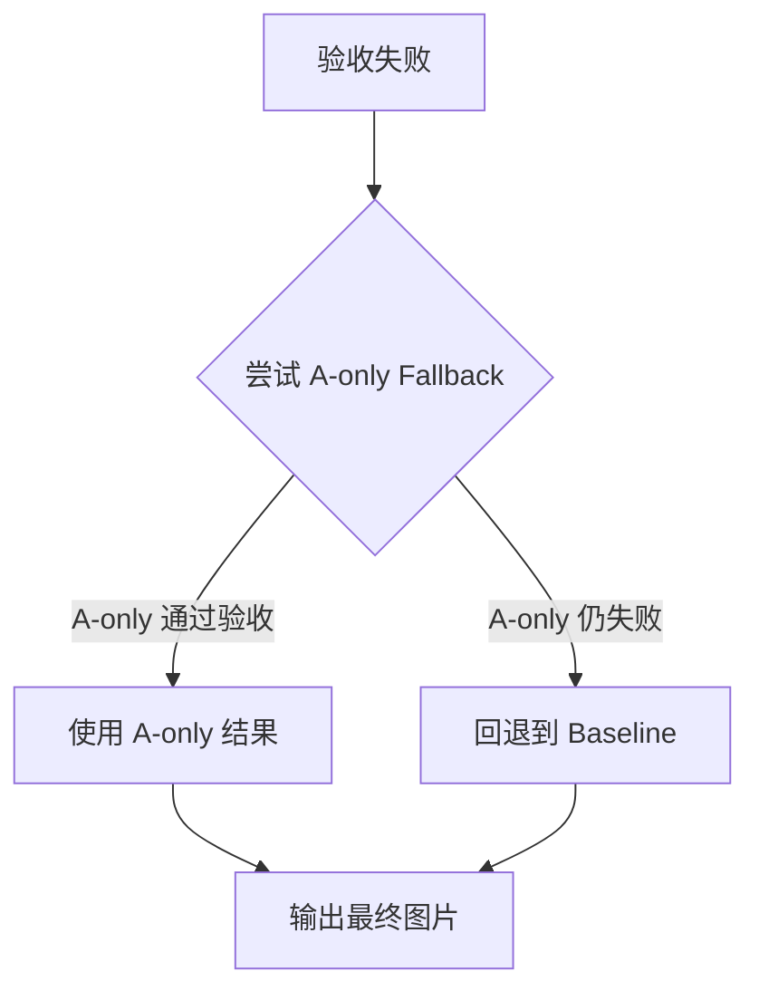
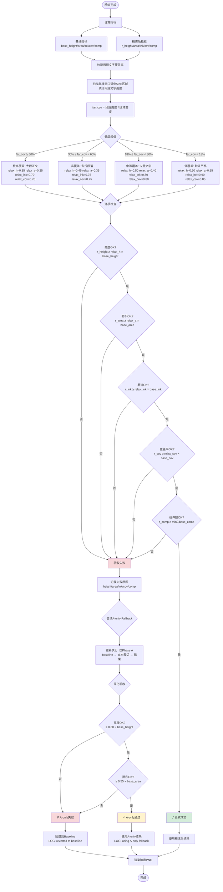

# PDF 图表提取架构分析文档

**文档日期**: 2025-10-15  
**脚本版本**: extract_pdf_assets.py (Robust Enhanced)  
**分析范围**: 图片与表格提取的完整业务逻辑与 Fallback 机制

---

## 1. 总体架构概述

`extract_pdf_assets.py` 是一个基于 PyMuPDF 和 pdfminer.six 的 PDF 图表提取工具，采用**多阶段渐进式精炼**策略，从粗粒度定位到精细裁剪，并通过**验收门槛与多级 Fallback** 保证质量。

### 1.1 核心设计理念

1. **Caption 驱动**: 以图注/表注为锚点，向上/下构造候选窗口
2. **多尺度扫描**: 锚点 V2 使用滑窗在多个高度上扫描，结合评分选择最佳窗口
3. **渐进式精炼**: A (文本裁切) → B (对象对齐) → D (自动去白边)，逐步优化边界
4. **安全验收**: 每次精炼后验证质量指标，不达标则回退到上一阶段
5. **智能 Caption 检测**: 区分真实图注与正文引用，避免误匹配

---

## 2. 完整业务流程（分步骤）

### 阶段 0：预处理与索引构建

#### 步骤 0.1: 文本提取（可选）
- **功能**: 使用 pdfminer.six 提取全文文本
- **输出**: `text/<pdf_name>.txt`
- **关键参数**: `--out-text`
- **影响**: 仅用于后续质量检查（弱对齐统计）

#### 步骤 0.2: 智能 Caption 索引构建（如果启用）
- **功能**: 预扫描全文，记录每个 Figure/Table 编号的所有出现位置
- **核心函数**: `build_caption_index()`
- **关键参数**:
  - `--smart-caption-detection` (default: True): 启用智能检测
  - `--debug-captions`: 输出候选项评分详情
  
- **评分维度**（总分 100）:
  1. **位置特征 (40分)**: 距离图像/绘图对象的距离
     - <10pt: 40分
     - 10-20pt: 35分
     - 20-40pt: 28分
     - 40-80pt: 18分
     - 80-150pt: 8分
  2. **格式特征 (30分)**: 字体加粗(15分) + 独立成段(10分) + 后续标点(5分)
  3. **结构特征 (20分)**: 下一行有描述(12分) + 段落长度(8分，长段落扣分)
  4. **上下文特征 (10分)**: 图注关键词(+10) vs 引用关键词(-15)

- **选择策略**: 得分 ≥25 的候选中选择最高分
- **影响**:
  - 启用时: 准确定位真实图注，避免误匹配正文引用
  - 禁用时: 按顺序匹配第一个出现的编号（可能误匹配）

#### 步骤 0.3: 全局锚点一致性预扫描
- **功能**: 对全文所有图/表预评分，决定统一采用 ABOVE 还是 BELOW
- **核心函数**: 在 `extract_figures`/`extract_tables` 主循环前执行
- **关键参数**:
  - `--global-anchor {off|auto}` (default: auto): 图片全局锚点
  - `--global-anchor-margin` (default: 0.02): 决策阈值
  - `--global-anchor-table {off|auto}` (default: auto): 表格全局锚点
  - `--global-anchor-table-margin` (default: 0.03): 表格阈值（更宽松）

- **评分公式**:
  - **图片**: `0.6 × 墨迹密度 + 0.4 × 对象覆盖率`
  - **表格**: `0.4 × 墨迹密度 + 0.25 × 列对齐峰 + 0.2 × 线段密度 + 0.15 × 对象占比`

- **决策规则**:
  - 如果 `below_total > above_total × (1 + margin)` → 全局采用 BELOW
  - 如果 `above_total > below_total × (1 + margin)` → 全局采用 ABOVE
  - 否则 → 保持 AUTO（每个图单独决策）

- **影响**:
  - 启用时: 同一文档中所有图/表采用一致的方向，减少混乱
  - 禁用时: 每个图单独决策，可能出现同文档中上下混合

---

### 阶段 1：Caption 定位与选择

#### 步骤 1.1: 页面级 Caption 收集
- **功能**: 在当前页查找所有匹配的图注/表注
- **正则模式**:
  - **图片**: `^\s*(?:Extended Data Figure|Supplementary Figure|Figure|Fig\.|图)\s*(?:S\s*)?(\d+)`
  - **表格**: `^\s*(?:Extended Data Table|Supplementary Table|Table|表)\s*(?:S\s*)?([A-Z]\d+|[IVX]+|\d+)`

- **智能模式**:
  - 从索引中获取候选项 → 评分 → 选择最佳
  - 合并后续行（直到遇到下一个图注或句点）

- **简单模式**:
  - 按顺序匹配第一个出现的编号
  - 逐行拼接图注文本

#### 步骤 1.2: Caption 边界框构建
- **功能**: 扩展图注 bbox，包含多行描述
- **关键逻辑**:
  ```python
  cap_rect = 第一行的 bbox
  for 后续行 in 当前 block:
      if 空行 or 下一个图注:
          break
      cap_rect = cap_rect | 后续行的 bbox
      if 行尾是句点 or 总字符数 >240:
          break
  ```

---

### 阶段 2：锚点选择与候选窗口构造

#### 模式 A: 锚点 V1（简单双窗口）

**步骤 2.1: 构造上下两个候选窗口**
- **上方窗口 (ABOVE)**:
  ```
  top_bound = 上一个图注底部 + 8pt (如无则 page_rect.y0)
  bot_bound = 当前图注顶部 - caption_gap
  y_top = max(page_rect.y0, bot_bound - clip_height, top_bound)
  y_bottom = min(bot_bound, y_top + clip_height)
  clip_above = Rect(x_left, y_top, x_right, y_bottom)
  ```

- **下方窗口 (BELOW)**:
  ```
  top = 当前图注底部 + caption_gap
  bot_bound = 下一个图注顶部 - 8pt (如无则 page_rect.y1)
  y_top = min(max(page_rect.y0, top), page_rect.y1 - 40)
  y_bottom = min(bot_bound, y_top + clip_height)
  clip_below = Rect(x_left, y_top, x_right, y_bottom)
  ```

**步骤 2.2: 窗口评分**
- **评分公式**: `0.6 × 墨迹密度 + 0.4 × 对象覆盖率`
  - **墨迹密度**: 低分辨率渲染后非白色像素占比（子采样估计）
  - **对象覆盖率**: 位图/矢量对象与窗口交集的面积占比

- **选择逻辑**:
  1. 如果图号在 `--below` 列表 → 强制选择 BELOW
  2. 如果图号在 `--above` 列表 → 强制选择 ABOVE
  3. 否则: 选择得分更高的窗口（BELOW 需高出 2% 才能胜出）

**关键参数**:
- `--clip-height` (default: 650pt): 窗口高度
- `--margin-x` (default: 20pt): 左右留白
- `--caption-gap` (default: 5pt): 图注与窗口边界的间距
- `--below`: 强制下方裁剪的图号列表
- `--above`: 强制上方裁剪的图号列表

**影响**:
- `clip_height` 过小: 可能截不到完整图片
- `clip_height` 过大: 可能包含多余内容（需后续精炼）
- `margin_x` 过大: 图片左右被裁
- `caption_gap` 过小: 可能包含图注本身

---

#### 模式 B: 锚点 V2（多尺度滑窗，默认）

**步骤 2.1: 多尺度候选窗口生成**
- **扫描高度**: `--scan-heights` (default: 240,320,420,520,640,720,820)
- **扫描步长**: `--scan-step` (default: 14pt)
- **中线护栏**: `--caption-mid-guard` (default: 6pt)

**上方扫描逻辑**:
```python
for height in scan_heights:
    y1 = cap_rect.y0 - caption_gap  # 固定底边
    y0_min = max(page_rect.y0, 上一个图注底部, 中线护栏)
    y0 = max(y0_min, y1 - height)
    while y0 + 40 <= y1:
        候选窗口 = Rect(x_left, y0, x_right, y1)
        计算得分并加入候选列表
        y0 -= scan_step
        if y0 < y0_min: break
```

**下方扫描逻辑**:
```python
for height in scan_heights:
    y0 = cap_rect.y1 + caption_gap  # 固定顶边
    y1_max = min(page_rect.y1, 下一个图注顶部, 中线护栏)
    y1 = min(y1_max, y0 + height)
    while y1 - 40 >= y0:
        候选窗口 = Rect(x_left, y0, x_right, y1)
        计算得分并加入候选列表
        y0 += scan_step
        y1 = min(y1_max, y0 + height)
        if y0 >= y1_max: break
```

**步骤 2.2: 候选窗口评分**
- **图片评分公式**:
  ```
  base = 0.55 × 墨迹密度 
       + 0.25 × 对象覆盖率 
       - 0.20 × 段落占比
       + 0.08 × min(1.0, 组件数 / 3)
  
  距离罚项 = scan_dist_lambda × (距离 / 页面高度)
  最终得分 = base - 距离罚项
  ```

- **表格评分公式**:
  ```
  base = 0.5 × 墨迹密度
       + 0.2 × 列对齐峰归一化
       + 0.15 × 线段密度
       + 0.15 × 对象占比
       - 0.25 × 段落占比
  
  最终得分 = base - 距离罚项
  ```

**步骤 2.3: 边缘吸附（Snap to Edges）**
- **功能**: 将选定窗口的上下边界吸附到最近的横向线段
- **关键参数**: `snap_px` (内置: 14pt)
- **影响**: 对齐表格的顶线和底线，避免半行裁切

**关键参数**:
- `--scan-heights`: 扫描高度列表（越多越精细，但越慢）
- `--scan-step`: 步长（越小越精细，但越慢）
- `--scan-dist-lambda` (default: 0.12): 距离罚项权重
  - 越大: 越倾向选择靠近图注的窗口
  - 越小: 距离影响减弱，更看重内容质量
- `--caption-mid-guard` (default: 6pt): 防跨图护栏
  - 越大: 越不容易跨越相邻图注的中线

**影响**:
- `scan_heights` 增加高度范围: 能捕获更高的图（如多子图）
- `scan_step` 减小: 定位更精准，但计算量增加
- `scan_dist_lambda` 增大: 优先选择紧邻图注的窗口（适合图注密集的文档）

---

### 阶段 3：渐进式精炼（A + B + D）

#### Phase A: 文本邻接裁切（三阶段 Trim）

**步骤 3.1: Phase A - 移除紧邻图注的文字（<24pt）**
- **功能**: 裁除图注附近的段落文字（如 Abstract、Introduction）
- **核心函数**: `_trim_clip_head_by_text()` (被 `_v2` 调用)
- **检测条件**:
  - 宽度占比 ≥ `--text-trim-width-ratio` (default: 0.5)
  - 字体大小在 `--text-trim-font-min` ~ `--text-trim-font-max` (default: 7~16pt)
  - 距离图注 ≤ `--adjacent-th` (default: 24pt)

- **裁切策略**:
  - **方向 = ABOVE** (图在上方): 向上收缩 **底边 (y1)**
  - **方向 = BELOW** (图在下方): 向下收缩 **顶边 (y0)**
  - 最多裁除 25% 原始窗口高度

**关键参数**:
- `--text-trim`: 启用文本裁切
- `--text-trim-width-ratio` (default: 0.5): 段落宽度阈值
- `--text-trim-font-min` / `--text-trim-font-max`: 字体范围
- `--text-trim-gap` (default: 6pt): 裁切后的间距
- `--adjacent-th` (default: 24pt): 紧邻阈值

**影响**:
- `text_trim_width_ratio` 降低: 更激进，会裁除较窄的文字（风险：误裁图注本身）
- `adjacent_th` 增大: 扩大裁切范围（风险：可能裁到图内文字）

---

**步骤 3.2: Phase B (Near-side) - 移除近侧远距文字（24~300pt）**
- **功能**: 裁除距离图注较远但仍在 **近侧**（靠近图注一侧）的段落文字
- **核心函数**: `_trim_clip_head_by_text_v2()` 中的 Phase B 部分
- **检测条件**:
  - 距离图注: `adjacent_th < 距离 ≤ far_text_th` (default: 24~300pt)
  - 位于近侧区域（近侧 = 靠近图注的 50% 区域）
  - 段落覆盖率 ≥ `--far-text-para-min-ratio` (default: 0.30)

- **裁切模式**:
  - `--far-text-trim-mode aggressive` (default): 移除所有远距段落
  - `--far-text-trim-mode conservative`: 仅当段落连续时才移除（行间距 <20pt）

**关键参数**:
- `--far-text-th` (default: 300pt): 远距文字检测范围
- `--far-text-para-min-ratio` (default: 0.30): 触发阈值
- `--far-text-trim-mode` (default: aggressive): 裁切模式

**影响**:
- `far_text_th` 增大: 检测范围扩大，能移除更远的文字
- `far_text_para_min_ratio` 降低: 更容易触发（风险：误裁小段文字）
- `conservative` 模式: 更保守，仅移除连续大段文字

---

**步骤 3.3: Phase C (Far-side) - 移除远侧大段正文（>100pt）**
- **功能**: 裁除距离图注较远且位于 **远侧**（远离图注一侧）的大段正文
- **核心函数**: `_trim_clip_head_by_text_v2()` 中的 Phase C 部分
- **检测条件**:
  - 距离图注 > `--far-side-min-dist` (default: 100pt)
  - 位于远侧区域（远侧 = 远离图注的 50% 区域）
  - 段落覆盖率 ≥ `--far-side-para-min-ratio` (default: 0.20)

- **裁切策略**:
  - **主流程**: 如果远侧段落覆盖率 ≥20%，移除所有远侧段落
  - **Fallback**: 如果覆盖率不足，检测 bullet/长文本行并移除:
    - Bullet 点（•/·/-）: 距离 >15pt
    - 超长文本（>60字符）: 距离 >18pt
    - 长文本（>30字符）: 距离 >20pt
    - 普通文字: 距离 >25pt

- **安全限制**: 最多裁除 50% 原始窗口高度

**关键参数**:
- `--far-side-min-dist` (default: 100pt): 远侧检测阈值
- `--far-side-para-min-ratio` (default: 0.20): 触发阈值

**影响**:
- `far_side_min_dist` 降低: 更激进，裁除更多远侧文字
- `far_side_para_min_ratio` 降低: 更容易触发主流程

---

#### Phase B: 对象连通域引导裁切

**步骤 3.4: 对象连通域合并与对齐**
- **功能**: 基于图像/矢量对象的连通域，精炼窗口边界
- **核心函数**: `_refine_clip_by_objects()`

**流程**:
1. **收集对象**: 筛选窗口内面积占比 ≥ `--object-min-area-ratio` 的对象
2. **合并连通域**: 将距离 ≤ `--object-merge-gap` 的对象合并
3. **选择主组件**: 选择距离图注最近的组件
4. **纵向/横向并集**: 如果有多个垂直/水平堆叠的组件，取并集
5. **调整边界**:
   - `--refine-near-edge-only` (default: True): 仅调整 **靠近图注的边**
   - `--refine-near-edge-only` = False: 调整所有边（风险：可能过度收缩）

**关键参数**:
- `--object-pad` (default: 8pt): 对象周围的 padding
- `--object-min-area-ratio` (default: 0.012 图片, 0.005 表格): 最小对象面积阈值
- `--object-merge-gap` (default: 6pt 图片, 4pt 表格): 合并间距
- `--refine-near-edge-only` (default: True): 仅调整近侧边界

**影响**:
- `object_min_area_ratio` 降低: 更敏感，能捕获小子图（风险：误捕噪点）
- `object_merge_gap` 增大: 更容易合并多个子图
- `refine_near_edge_only = False`: 双向调整（风险：过度收缩）

---

**步骤 3.5: 远端边缘外扩（防半幅裁切）**
- **功能**: 如果远端边（远离图注一侧）有对象紧贴，向外扩展以补齐整幅
- **检测条件**: 远端边有对象的边界距离窗口边界 ≤2pt
- **扩展策略**: 每次扩展 60pt，最多扩展 200pt

**影响**: 自动修复"半幅"问题，无需手动调参

---

#### Phase D: 文本掩膜辅助自动裁剪

**步骤 3.6: 文本掩膜构建（可选）**
- **功能**: 在自动裁剪前，标记段落文字区域为"白色"（忽略墨迹）
- **核心函数**: `_build_text_masks_px()`
- **条件**: `--autocrop-mask-text` (default: True for figures, False for tables)
- **检测范围**: 仅限 **近侧区域**（`--mask-top-frac` 默认 60%）

**关键参数**:
- `--autocrop-mask-text`: 启用文本掩膜
- `--mask-font-max` (default: 14pt): 最大字体
- `--mask-width-ratio` (default: 0.5): 最小宽度占比
- `--mask-top-frac` (default: 0.6): 近侧区域比例

**影响**:
- 启用时: 避免段落文字被误认为"墨迹"，导致去白边失败
- 禁用时: 可能保留过多白边（表格通常禁用，因为需要保留文字）

---

**步骤 3.7: 像素级白边检测与裁剪**
- **功能**: 扫描位图，检测非白色区域的包围盒
- **核心函数**: `detect_content_bbox_pixels()`
- **流程**:
  1. 按行/列子采样扫描（步长 = max(1, w//1000)）
  2. 检测非白色像素（RGB < `--autocrop-white-th`）
  3. 收缩到包围盒 + `--autocrop-pad` 像素 padding

**步骤 3.8: 远端边缘保护**
- **功能**: 在远端边（远离图注一侧）额外扩展，避免轻微过裁
- **关键参数**: `--protect-far-edge-px` (default: 18pt 图片, 10pt 表格)
- **影响**: 增大值可保留更多远端内容（如图片顶部的标题）

**步骤 3.9: 收缩限制与最小高度**
- **功能**: 防止自动裁剪过度收缩
- **关键参数**:
  - `--autocrop-shrink-limit` (default: 0.30): 最多收缩 30% 面积
  - `--autocrop-min-height-px` (default: 80px): 最小高度

- **调整策略**: 如果收缩过度，向 **近侧边**（靠近图注）扩展回去

**步骤 3.10: 近侧边缘回扩**
- **功能**: 在近侧边（靠近图注一侧）额外扩展，避免裁掉坐标轴/标签
- **关键参数**: `--near-edge-pad-px` (default: 32px)
- **限制**: 不得越过图注边界（`cap_rect.y0 - caption_gap*0.5`）

**影响**: 增大值可保留更多近侧内容（如底部坐标轴），但可能误包含图注

---

### 阶段 4：验收与 Fallback 机制

#### 步骤 4.1: 质量指标计算

**基线指标**（Phase A 之前的原始窗口）:
- `base_height`: 窗口高度
- `base_area`: 窗口面积
- `base_ink`: 墨迹密度
- `base_cov`: 对象覆盖率
- `base_comp`: 组件数量

**精炼后指标**（Phase A+B+D 之后）:
- `r_height`, `r_area`, `r_ink`, `r_cov`, `r_comp`

---

#### 步骤 4.2: 远侧文字覆盖率检测

**功能**: 检测基线窗口的 **远侧区域**（50%）是否包含大段正文

**计算逻辑**:
```python
far_cov = 远侧段落总高度 / 远侧区域高度
```

**分层放宽阈值**（根据 `far_cov`）:

| 远侧覆盖率 | 高度阈值 | 面积阈值 | 墨迹阈值 | 覆盖率阈值 | 说明 |
|-----------|---------|---------|---------|-----------|------|
| ≥60% | 0.35 | 0.25 | 0.70 | 0.70 | 极高覆盖（大段正文） |
| 30-60% | 0.45 | 0.35 | 0.75 | 0.75 | 高覆盖（多行段落） |
| 18-30% | 0.50 | 0.40 | 0.80 | 0.80 | 中等覆盖（少量文字） |
| <18% | 0.60 | 0.55 | 0.90 | 0.85 | 低覆盖（默认严格） |

**说明**: 如果基线窗口包含大段正文（Phase C 需要移除），允许精炼后窗口更大幅度收缩

---

#### 步骤 4.3: 验收门槛判定

**检查条件**（全部通过才算成功）:
1. **高度**: `r_height ≥ relax_h × base_height`
2. **面积**: `r_area ≥ relax_a × base_area`
3. **墨迹密度**: `r_ink ≥ relax_ink × base_ink` (如果 `base_ink > 0`)
4. **对象覆盖率**: `r_cov ≥ relax_cov × base_cov` (如果 `base_cov > 0`)
5. **组件数量**: `r_comp ≥ min(2, base_comp)` (如果 `base_comp ≥ 2`)

**图片额外检查**（表格类似，但用文本行数代替部分指标）:
- 多子图保护: 如果基线有 ≥2 个组件，精炼后至少保留 2 个

---

#### 步骤 4.4: Fallback 策略

**失败时的回退逻辑**:



**A-only Fallback**:
- 仅执行 Phase A (文本裁切)，跳过 B (对象对齐) 和 D (自动裁剪)
- 验收条件: `height ≥ 0.60 × base_height` AND `area ≥ 0.55 × base_area`

**Baseline Fallback**:
- 直接使用原始窗口（锚点阶段的选定窗口）
- 无任何精炼

**日志输出**:
```
[WARN] Fig 3 p5: refinement rejected (height=45%, area=38%, ink=72%), trying fallback
[INFO] Fig 3 p5: using A-only fallback
```
或
```
[INFO] Fig 3 p5: reverted to baseline
```

---

## 3. 关键参数影响矩阵

### 3.1 锚点阶段参数

| 参数 | 默认值 | 增大影响 | 减小影响 | 推荐场景 |
|------|--------|----------|----------|----------|
| `--clip-height` | 650pt | 包含更高的图（多子图） | 可能截不完整 | 多子图堆叠: 增大到 720-820 |
| `--margin-x` | 20pt | 左右留白增大 | 可能包含页边注释 | 宽版面文档: 增大到 30-40 |
| `--caption-gap` | 5pt | 图注与图片间距增大 | 可能包含图注本身 | 图注紧贴: 增大到 8-10 |
| `--scan-step` | 14pt | 计算量增大，定位更精准 | 速度变快，精度降低 | 复杂排版: 减小到 10-12 |
| `--scan-dist-lambda` | 0.12 | 优先选择紧邻图注的窗口 | 距离影响减弱 | 图注密集: 增大到 0.15-0.18 |
| `--caption-mid-guard` | 6pt | 更难跨越相邻图注中线 | 可能跨图 | 图注密集: 增大到 8-12 |

### 3.2 文本裁切参数

| 参数 | 默认值 | 增大影响 | 减小影响 | 推荐场景 |
|------|--------|----------|----------|----------|
| `--text-trim-width-ratio` | 0.5 | 仅裁除宽段落 | 裁除更多窄文本（风险高） | 保守裁切: 增大到 0.6-0.7 |
| `--adjacent-th` | 24pt | 扩大紧邻裁切范围 | 仅裁除最近的文字 | 文字紧贴图: 增大到 28-32 |
| `--far-text-th` | 300pt | 检测更远的文字 | 仅检测中距离文字 | 大段正文: 增大到 400-500 |
| `--far-side-para-min-ratio` | 0.20 | 更难触发 Phase C | 更容易触发（风险高） | 保守模式: 增大到 0.25-0.30 |

### 3.3 对象对齐参数

| 参数 | 默认值 | 增大影响 | 减小影响 | 推荐场景 |
|------|--------|----------|----------|----------|
| `--object-min-area-ratio` | 0.012 | 仅捕获大对象 | 捕获更多小对象（风险：噪点） | 小子图: 减小到 0.008-0.010 |
| `--object-merge-gap` | 6pt | 更容易合并多子图 | 子图分离 | 多子图紧密: 增大到 8-10 |
| `--object-pad` | 8pt | 对象周围留白增大 | 裁剪更紧凑 | 保留边框: 增大到 10-12 |

### 3.4 自动裁剪参数

| 参数 | 默认值 | 增大影响 | 减小影响 | 推荐场景 |
|------|--------|----------|----------|----------|
| `--autocrop-pad` | 30px | 保留更多白边 | 裁剪更紧凑 | 保留图注: 增大到 40-50 |
| `--autocrop-white-th` | 250 | 更严格（淡灰也算墨迹） | 更宽松（浅灰算白边） | 浅色背景: 减小到 240-245 |
| `--protect-far-edge-px` | 18px | 远端保留更多 | 可能过裁远端 | 图顶有标题: 增大到 20-24 |
| `--near-edge-pad-px` | 32px | 近侧保留更多（坐标轴） | 可能误包含图注 | 底部有轴标: 增大到 36-40 |
| `--autocrop-shrink-limit` | 0.30 | 允许收缩更多 | 限制收缩（更保守） | 严格模式: 减小到 0.25 |

---

## 4. Mermaid 流程图

### 4.1 完整提取流程（含 Fallback）

```mermaid
graph TD
    Start([开始: PDF 输入]) --> Init[阶段0: 预处理]
    
    Init --> Init1[0.1 文本提取<br/>pdfminer.six]
    Init --> Init2{0.2 启用智能Caption检测?}
    Init2 -->|是| Init3[构建Caption索引<br/>四维评分: 位置40+格式30+结构20+上下文10]
    Init2 -->|否| Init4[使用简单模式]
    Init3 --> Init5{0.3 启用全局锚点?}
    Init4 --> Init5
    Init5 -->|是| Init6[预扫描全文<br/>计算ABOVE vs BELOW总分]
    Init5 -->|否| Stage1
    Init6 --> Init7{决策}
    Init7 -->|below > above×1.02| Init8[global_side = BELOW]
    Init7 -->|above > below×1.02| Init9[global_side = ABOVE]
    Init7 -->|否则| Init10[global_side = AUTO]
    Init8 --> Stage1
    Init9 --> Stage1
    Init10 --> Stage1
    
    Stage1[阶段1: Caption定位] --> Stage1_1{智能模式?}
    Stage1_1 -->|是| Stage1_2[从索引获取候选项]
    Stage1_1 -->|否| Stage1_3[按顺序匹配第一个]
    Stage1_2 --> Stage1_4[评分并选择最佳<br/>阈值≥25分]
    Stage1_3 --> Stage1_5[合并后续行<br/>构建caption文本]
    Stage1_4 --> Stage1_5
    Stage1_5 --> Stage1_6[扩展caption bbox]
    
    Stage1_6 --> Stage2{阶段2: 锚点模式选择}
    
    Stage2 -->|V1| V1_1[2.1 构造上/下两个候选窗口<br/>高度=clip_height]
    V1_1 --> V1_2[2.2 评分: 0.6×墨迹+0.4×对象]
    V1_2 --> V1_3{强制方向?}
    V1_3 -->|--below| V1_4[选择BELOW]
    V1_3 -->|--above| V1_5[选择ABOVE]
    V1_3 -->|AUTO| V1_6{BELOW得分 > ABOVE×1.02?}
    V1_6 -->|是| V1_4
    V1_6 -->|否| V1_5
    V1_4 --> Stage3
    V1_5 --> Stage3
    
    Stage2 -->|V2| V2_1[2.1 多尺度滑窗生成候选<br/>高度列表×步长扫描]
    V2_1 --> V2_2{尊重global_side?}
    V2_2 -->|ABOVE| V2_3[仅扫描上方]
    V2_2 -->|BELOW| V2_4[仅扫描下方]
    V2_2 -->|AUTO| V2_5[扫描上下两侧]
    V2_3 --> V2_6[2.2 候选评分<br/>图: 0.55×墨迹+0.25×对象-0.20×段落+组件奖励<br/>表: 0.5×墨迹+0.2×列峰+0.15×线密+0.15×对象-0.25×段落]
    V2_4 --> V2_6
    V2_5 --> V2_6
    V2_6 --> V2_7[距离罚项: -lambda×距离/页高]
    V2_7 --> V2_8[选择最高分候选]
    V2_8 --> V2_9[2.3 边缘吸附<br/>对齐最近的横线±14pt]
    V2_9 --> Stage3
    
    Stage3[阶段3: 渐进式精炼<br/>保存基线指标] --> Stage3_A{启用文本裁切?}
    
    Stage3_A -->|是| PhaseA[Phase A: 文本邻接裁切]
    Stage3_A -->|否| Stage3_B
    
    PhaseA --> PhaseA1[Phase A1: 移除紧邻文字<br/>距离<adjacent_th 24pt<br/>宽度≥50% 字体7-16pt<br/>最多裁25%高度]
    PhaseA1 --> PhaseB1{段落覆盖率≥30%?}
    PhaseB1 -->|是| PhaseB2[Phase B: 移除近侧远距文字<br/>距离24-300pt<br/>模式: aggressive/conservative<br/>最多裁60%高度]
    PhaseB1 -->|否| PhaseC1
    PhaseB2 --> PhaseC1{检测远侧区域}
    
    PhaseC1 --> PhaseC2{远侧段落覆盖率≥20%?}
    PhaseC2 -->|是| PhaseC3[Phase C主流程:<br/>移除所有远侧段落>100pt<br/>最多裁50%高度]
    PhaseC2 -->|否| PhaseC4[Phase C Fallback:<br/>检测bullet/长文本行<br/>分层距离阈值15-25pt]
    PhaseC3 --> Stage3_B
    PhaseC4 --> Stage3_B
    
    Stage3_B{启用对象对齐?} -->|是| PhaseB_Obj[Phase B: 对象连通域引导]
    Stage3_B -->|否| Stage3_C
    
    PhaseB_Obj --> PhaseB_1[筛选对象: 面积≥min_area_ratio<br/>图0.012 表0.005]
    PhaseB_1 --> PhaseB_2[合并连通域: gap≤merge_gap<br/>图6pt 表4pt]
    PhaseB_2 --> PhaseB_3[选择距caption最近的组件]
    PhaseB_3 --> PhaseB_4{多组件垂直/横向堆叠?}
    PhaseB_4 -->|是| PhaseB_5[取并集覆盖所有组件]
    PhaseB_4 -->|否| PhaseB_6[使用单个组件]
    PhaseB_5 --> PhaseB_7{near-edge-only模式?}
    PhaseB_6 --> PhaseB_7
    PhaseB_7 -->|是| PhaseB_8[仅调整靠近caption的边+pad8pt]
    PhaseB_7 -->|否| PhaseB_9[调整所有边+pad8pt]
    PhaseB_8 --> PhaseB_10[远端外扩检测]
    PhaseB_9 --> PhaseB_10
    PhaseB_10 --> PhaseB_11{远端边有对象紧贴?}
    PhaseB_11 -->|是| PhaseB_12[向远端外扩60pt<br/>最多200pt]
    PhaseB_11 -->|否| Stage3_C
    PhaseB_12 --> Stage3_C
    
    Stage3_C{启用自动裁剪?} -->|是| PhaseD[Phase D: 文本掩膜辅助裁剪]
    Stage3_C -->|否| Stage4
    
    PhaseD --> PhaseD_1{启用文本掩膜?}
    PhaseD_1 -->|是| PhaseD_2[标记近侧60%的段落文字<br/>字体≤14pt 宽度≥50%]
    PhaseD_1 -->|否| PhaseD_3[直接检测白边]
    PhaseD_2 --> PhaseD_3
    PhaseD_3 --> PhaseD_4[像素级扫描<br/>阈值=white_th 250<br/>padding=30px]
    PhaseD_4 --> PhaseD_5[远端边缘保护<br/>+protect_far_edge_px 18px]
    PhaseD_5 --> PhaseD_6{收缩超限?}
    PhaseD_6 -->|高度<80px or 收缩>30%| PhaseD_7[向近侧边扩展回去<br/>直到满足最小高度]
    PhaseD_6 -->|否| PhaseD_8[近侧边缘回扩<br/>+near_edge_pad_px 32px<br/>不越过caption]
    PhaseD_7 --> PhaseD_8
    PhaseD_8 --> Stage4
    
    Stage4[阶段4: 验收与Fallback] --> Stage4_1[计算精炼后指标<br/>r_height r_area r_ink r_cov r_comp]
    Stage4_1 --> Stage4_2[检测远侧文字覆盖率<br/>far_cov]
    Stage4_2 --> Stage4_3{分层放宽阈值}
    Stage4_3 -->|far_cov≥60%| Stage4_4[极高覆盖<br/>h≥0.35 a≥0.25 ink≥0.70 cov≥0.70]
    Stage4_3 -->|far_cov≥30%| Stage4_5[高覆盖<br/>h≥0.45 a≥0.35 ink≥0.75 cov≥0.75]
    Stage4_3 -->|far_cov≥18%| Stage4_6[中等覆盖<br/>h≥0.50 a≥0.40 ink≥0.80 cov≥0.80]
    Stage4_3 -->|far_cov<18%| Stage4_7[低覆盖<br/>h≥0.60 a≥0.55 ink≥0.90 cov≥0.85]
    
    Stage4_4 --> Stage4_8{全部指标通过?}
    Stage4_5 --> Stage4_8
    Stage4_6 --> Stage4_8
    Stage4_7 --> Stage4_8
    
    Stage4_8 -->|是| Stage4_9[✓ 验收成功<br/>使用精炼后结果]
    Stage4_8 -->|否| Stage4_10[✗ 验收失败<br/>记录失败原因]
    
    Stage4_10 --> Fallback1{尝试A-only}
    Fallback1 --> Fallback2[仅执行Phase A文本裁切<br/>跳过B对象对齐和D自动裁剪]
    Fallback2 --> Fallback3{A-only验收<br/>h≥0.60 a≥0.55?}
    Fallback3 -->|是| Fallback4[✓ 使用A-only结果<br/>输出日志: using A-only fallback]
    Fallback3 -->|否| Fallback5[✗ 回退到Baseline<br/>使用原始锚点窗口<br/>输出日志: reverted to baseline]
    
    Stage4_9 --> Output
    Fallback4 --> Output
    Fallback5 --> Output
    
    Output[最终输出] --> Output1[渲染PNG<br/>DPI=300<br/>文件名=sanitize+限制12词]
    Output1 --> Output2[写入index.json]
    Output2 --> Output3[QC质量检查<br/>统计图/表数量<br/>弱对齐检查]
    Output3 --> End([结束])
    
    style Start fill:#e1f5e1
    style End fill:#ffe1e1
    style Stage4_9 fill:#d4edda
    style Fallback4 fill:#fff3cd
    style Fallback5 fill:#f8d7da
    style PhaseA fill:#cfe2ff
    style PhaseB_Obj fill:#cfe2ff
    style PhaseD fill:#cfe2ff
```



### 4.2 验收与 Fallback 决策树（详细版）



---

## 5. 调试模式设计方案

### 5.1 调试模式功能需求

1. **保留原始"大底"**: Phase A 确定的原始窗口
2. **多色线框标注**: 不同阶段用不同颜色
3. **图例说明**: 在图片上标注各阶段含义

### 5.2 调试参数

```bash
--debug-visual  # 启用可视化调试模式
```

### 5.3 线框颜色方案

| 阶段 | 颜色 | RGB | 说明 |
|------|------|-----|------|
| Baseline (锚点选择) | 蓝色 | (0, 102, 255) | 原始窗口 |
| Phase A (文本裁切) | 绿色 | (0, 200, 0) | 去文字后 |
| Phase B (对象对齐) | 橙色 | (255, 140, 0) | 对象精炼后 |
| Phase D (自动裁剪) | 红色 | (255, 0, 0) | 最终结果 |
| Caption | 紫色 | (148, 0, 211) | 图注位置 |
| Fallback | 黄色 | (255, 255, 0) | 回退结果 |

### 5.4 输出文件命名

```
images/debug/Figure_1_debug_stages.png  # 带多色线框的"大底"
images/debug/Figure_1_final.png         # 实际输出（与正常模式一致）
images/debug/Figure_1_legend.txt        # 文字说明各阶段尺寸
```

---

## 6. 使用建议

### 6.1 快速开始（推荐预设）

```bash
python scripts/extract_pdf_assets.py \
  --pdf paper.pdf \
  --preset robust
```

### 6.2 问题诊断流程

#### 问题 1: 图片截不完整（顶部/底部被裁）

**原因分析**:
- 锚点窗口高度不足
- Phase A/C 过度裁切

**解决方案**:
```bash
# 1. 增大扫描高度范围
--scan-heights 240,320,420,520,640,720,820,920

# 2. 放宽远侧保护
--protect-far-edge-px 24

# 3. 对特定图禁用精炼
--no-refine 3,5
```

#### 问题 2: 包含过多正文（Abstract/Introduction 混入）

**原因分析**:
- Phase A/C 未生效
- 文本检测阈值过高

**解决方案**:
```bash
# 1. 确保启用文本裁切
--text-trim

# 2. 降低宽度阈值（更激进）
--text-trim-width-ratio 0.4

# 3. 扩大邻接阈值
--adjacent-th 32

# 4. 启用远侧裁切
--far-side-para-min-ratio 0.15
```

#### 问题 3: 多子图被截成单个

**原因分析**:
- 对象合并间距过小
- Phase D 过度收缩

**解决方案**:
```bash
# 1. 增大对象合并间距
--object-merge-gap 10

# 2. 降低最小面积阈值
--object-min-area-ratio 0.008

# 3. 放宽收缩限制
--autocrop-shrink-limit 0.20

# 4. 增大最小高度
--autocrop-min-height-px 120
```

#### 问题 4: 验收频繁失败，总是回退到 Baseline

**原因分析**:
- 远侧覆盖率检测异常
- 阈值过严

**解决方案**:
```bash
# 1. 查看日志，确认失败原因
# 输出示例: [WARN] Fig 3 p5: refinement rejected (height=45%, area=38%, ink=72%)

# 2. 如果是远侧文字导致，确认 Phase C 是否执行
--debug-captions  # 检查 caption 是否正确

# 3. 禁用验收（仅调试）
--no-refine-safe

# 4. 使用保守参数
--far-side-para-min-ratio 0.25
--autocrop-shrink-limit 0.25
```

### 6.3 表格特化建议

表格与图片的主要区别：
- 表格通常**不需要文本掩膜**（`--no-table-mask-text`）
- 表格需要**保留横线**（边缘吸附）
- 表格的**对象面积阈值更低**（`--table-object-min-area-ratio 0.005`）

---

## 7. 性能与质量权衡

### 7.1 速度优化

- **减少扫描高度数量**: `--scan-heights 320,520,720`（3 个高度）
- **增大扫描步长**: `--scan-step 20`
- **禁用智能 Caption 检测**: `--no-smart-caption-detection`
- **禁用全局锚点**: `--global-anchor off`

### 7.2 质量优化

- **增加扫描高度数量**: `--scan-heights 240,280,320,360,420,480,520,640,720,820`
- **减小扫描步长**: `--scan-step 10`
- **启用所有精炼**: `--text-trim --autocrop --autocrop-mask-text`
- **严格验收**: 默认参数（不添加 `--no-refine-safe`）

---

## 8. 总结

本架构采用**多阶段渐进式精炼 + 安全验收与 Fallback** 的设计，核心优势：

1. **鲁棒性**: 通过 Fallback 机制保证最坏情况也能输出可用结果
2. **灵活性**: 丰富的参数允许针对不同文档精调
3. **智能性**: Caption 智能检测 + 全局锚点一致性减少人工干预
4. **可观测性**: 详细日志 + 可视化调试模式便于问题诊断

**适用场景**:
- ✅ 学术论文（标准 Figure/Table 排版）
- ✅ 技术报告（多子图堆叠）
- ✅ 专利文档（附录表/罗马数字）
- ⚠️ 复杂排版（图文混排、跨页图）需精调参数

---

**文档版本**: v1.0  
**最后更新**: 2025-10-15  
**维护者**: PDF Summary Agent Team

